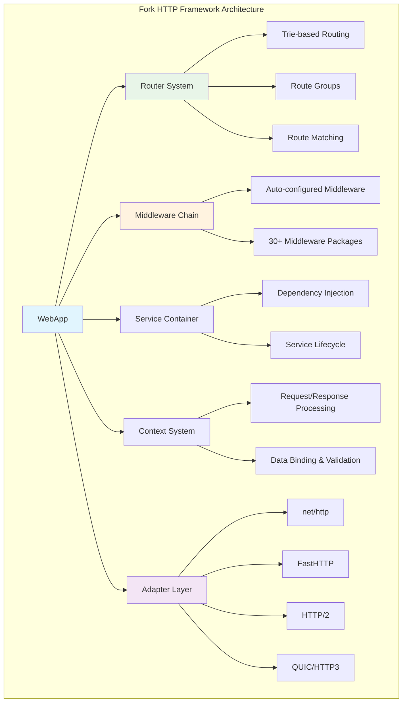
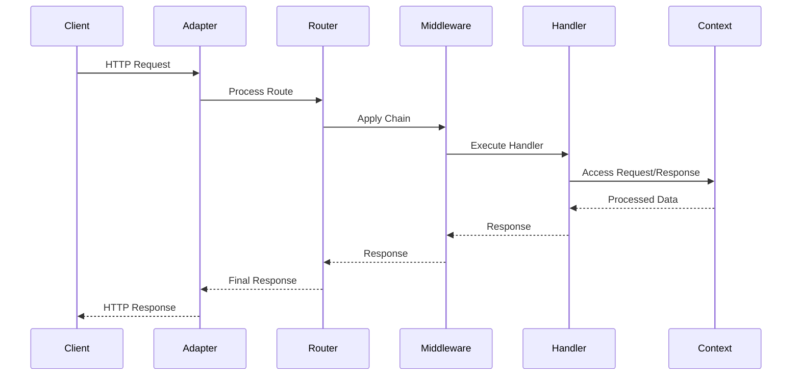

# Fork HTTP Framework


**Framework HTTP linh hoạt và hiệu năng cao cho Go với kiến trúc adapter pattern**

[📚 Tài liệu](docs/) • [🚀 Bắt đầu nhanh](#-bắt-đầu-nhanh) • [📖 Hướng dẫn](#-tài-liệu-chi-tiết) • [🔧 Cấu hình](#-cấu-hình-framework)


---

## 🌟 Tổng quan

Fork HTTP Framework là một framework HTTP enterprise-grade được thiết kế cho các ứng dụng Go production. Framework cung cấp kiến trúc **adapter pattern** linh hoạt, hỗ trợ multiple HTTP engines và tối ưu hiệu năng với **trie-based routing** và **zero-allocation patterns**.

### ✨ Điểm nổi bật

- 🏗️ **Adapter Pattern**: Hỗ trợ multiple HTTP engines (net/http, fasthttp, http2, quic)
- 🚄 **High Performance**: Zero-allocation routing với trie structure optimization
- 🛡️ **Production Ready**: Graceful shutdown, error handling và monitoring tích hợp
- ⚙️ **YAML Configuration**: Auto-loading middleware và configuration management
- 🔗 **Dependency Injection**: Service container tích hợp với lifecycle management
- 🎯 **Context System**: Powerful context với data binding và validation
- 🔀 **Flexible Routing**: Route groups, parameters, wildcards và middleware chains
- 📦 **30+ Middleware**: Auto-configured middleware ecosystem với YAML

## 📦 Cài đặt

```bash
# Framework core
go get go.fork.vn/fork

# Các adapters
go get github.com/Fork/adapter/fasthttp    # FastHTTP adapter
go get github.com/Fork/adapter/http2       # HTTP/2 support  
go get github.com/Fork/adapter/quic        # HTTP/3 QUIC support
```

## 🚀 Bắt đầu nhanh

### Ứng dụng cơ bản

```go
package main

import (
    "go.fork.vn/fork"
)

func main() {
    // Tạo WebApp instance
    app := fork.New()
    
    // Định nghĩa basic routes
    app.Get("/", func(c fork.Context) error {
        return c.String(200, "Hello, Fork HTTP Framework!")
    })
    
    app.Get("/health", func(c fork.Context) error {
        return c.JSON(200, map[string]interface{}{
            "status": "ok",
            "framework": "Fork HTTP",
        })
    })
    
    // Route với parameters
    app.Get("/user/:id", func(c fork.Context) error {
        userID := c.Param("id")
        return c.JSON(200, map[string]string{
            "user_id": userID,
            "message": "User profile",
        })
    })
    
    // Khởi động server
    app.Listen(":3000")
}
```

### Ứng dụng với Configuration

```go
package main

import (
    "log"
    "go.fork.vn/fork"
    "go.fork.vn/fork/adapter"
)

func main() {
    // Load configuration từ YAML
    config, err := fork.LoadConfigFromFile("configs/app.yaml")
    if err != nil {
        log.Fatal("Failed to load config:", err)
    }
    
    // Tạo application với config
    app := fork.NewWithConfig(config)
    
    // Sử dụng FastHTTP adapter cho high performance
    fastAdapter := adapter.NewFastHTTPAdapter()
    app.SetAdapter(fastAdapter)
    
    // API routes group
    api := app.Group("/api/v1")
    {
        api.Get("/health", healthHandler)
        api.Post("/users", createUserHandler)
        api.Get("/users/:id", getUserHandler)
        api.Put("/users/:id", updateUserHandler)
    }
    
    // Khởi động với graceful shutdown
    app.ListenWithGracefulShutdown(":8080")
}
```

### Configuration YAML

```yaml
# configs/app.yaml
graceful_shutdown:
  enabled: true
  timeout: 30
  wait_for_connections: true
  signal_buffer_size: 1

http:
  middleware:
    # Core middleware
    recover:
      enabled: true
    logger:
      enabled: true
      format: "json"
    cors:
      enabled: true
      allow_origins: ["*"]
    
    # Performance middleware  
    compression:
      enabled: true
      level: 6
    cache:
      enabled: true
      ttl: 300
```

## 🏗️ Kiến trúc Framework



### Core Components Flow



## 🎯 Context System

### Request Processing & Data Binding

```go
type User struct {
    ID    int    `json:"id" validate:"required"`
    Name  string `json:"name" validate:"required,min=2,max=50"`
    Email string `json:"email" validate:"required,email"`
    Age   int    `json:"age" validate:"min=18,max=120"`
}

func createUserHandler(c fork.Context) error {
    var user User
    
    // Parse JSON request body
    if err := c.BodyParser(&user); err != nil {
        return c.Status(400).JSON(map[string]interface{}{
            "error": "Invalid JSON format",
            "details": err.Error(),
        })
    }
    
    // Validate struct data với tags
    if err := c.Validate(&user); err != nil {
        return c.Status(422).JSON(map[string]interface{}{
            "error": "Validation failed",
            "details": err.Error(),
        })
    }
    
    // Access route parameters
    userID := c.Param("id")
    
    // Access query parameters với default values
    page := c.QueryInt("page", 1)
    limit := c.QueryInt("limit", 10)
    filter := c.Query("filter", "active")
    
    // Set response headers
    c.Set("X-User-ID", userID)
    c.Set("X-Request-ID", c.Get("request_id"))
    
    // Return JSON response
    return c.Status(201).JSON(map[string]interface{}{
        "user": user,
        "meta": map[string]interface{}{
            "page": page,
            "limit": limit,
            "filter": filter,
        },
    })
}
```

## 🚦 Router System

### Advanced Routing Features

```go
app := fork.New()

// Basic HTTP methods
app.Get("/", homeHandler)
app.Post("/users", createUserHandler)
app.Put("/users/:id", updateUserHandler)
app.Delete("/users/:id", deleteUserHandler)
app.Patch("/users/:id", patchUserHandler)

// Route parameters với patterns
app.Get("/users/:id", getUserHandler)                    // Named parameter
app.Get("/users/:id/posts/:postId", getPostHandler)     // Multiple parameters
app.Get("/files/*filepath", fileHandler)                // Wildcard parameter

// Optional parameters
app.Get("/search/:query?", searchHandler)               // Optional query

// Regex constraints (nếu supported)
app.Get("/users/:id([0-9]+)", getUserByIDHandler)       // Numeric ID only

// Route groups với middleware
api := app.Group("/api/v1")
{
    // Public endpoints
    api.Get("/health", healthHandler)
    api.Post("/auth/login", loginHandler)
    
    // Protected endpoints group
    protected := api.Group("/", authMiddleware)
    {
        protected.Get("/profile", getProfileHandler)
        protected.Put("/profile", updateProfileHandler)
        
        // Admin endpoints
        admin := protected.Group("/admin", adminMiddleware)
        {
            admin.Get("/users", listUsersHandler)
            admin.Delete("/users/:id", deleteUserHandler)
            admin.Get("/stats", getStatsHandler)
        }
    }
}

// Static file serving
app.Static("/static", "./public")
app.Static("/uploads", "./uploads")
```

### Route Performance với Trie

```go
// Framework sử dụng trie structure cho fast route matching
// Zero-allocation patterns cho high-performance routing
// O(log n) lookup time với memory optimization
```

## 🛠️ Middleware System

### Auto-configured Middleware

Framework hỗ trợ **30+ middleware packages** được auto-load thông qua YAML configuration:

```yaml
# configs/app.yaml
http:
  middleware:
    # Security middleware
    recover:
      enabled: true
    helmet:
      enabled: true
      hsts: true
      xss_protection: true
    cors:
      enabled: true
      allow_origins: ["https://example.com"]
      allow_methods: ["GET", "POST", "PUT", "DELETE"]
      
    # Monitoring & Logging
    logger:
      enabled: true
      format: "json"
      level: "info"
    monitor:
      enabled: true
      metrics_path: "/metrics"
      
    # Performance
    compression:
      enabled: true
      level: 6
      types: ["text/html", "application/json"]
    cache:
      enabled: true
      ttl: 300
      memory_limit: "100MB"
      
    # Rate limiting
    rate_limit:
      enabled: true
      max_requests: 100
      window: "1m"
      
    # Authentication
    jwt:
      enabled: true
      secret: "${JWT_SECRET}"
      expire: "24h"
```

### Custom Middleware

```go
// Custom middleware function
func customAuthMiddleware(c fork.Context) error {
    token := c.Get("Authorization")
    if token == "" {
        return c.Status(401).JSON(map[string]string{
            "error": "Missing authorization token",
        })
    }
    
    // Validate token logic...
    // Set user context...
    
    return c.Next() // Continue to next middleware/handler
}

// Apply middleware
app.Use(customAuthMiddleware)

// Route-specific middleware
app.Get("/protected", authMiddleware, protectedHandler)
```

## 🔧 Cấu hình Framework

### WebApp Configuration Structure

```go
type WebAppConfig struct {
    GracefulShutdown GracefulShutdownConfig `yaml:"graceful_shutdown"`
}

type GracefulShutdownConfig struct {
    Enabled            bool `yaml:"enabled"`
    Timeout            int  `yaml:"timeout"`
    WaitForConnections bool `yaml:"wait_for_connections"`
    SignalBufferSize   int  `yaml:"signal_buffer_size"`
    
    // Callback functions
    OnShutdownStart    func()
    OnShutdownComplete func()
    OnShutdownError    func(error)
}
```

### Production Configuration

```yaml
# configs/production.yaml
graceful_shutdown:
  enabled: true
  timeout: 30
  wait_for_connections: true
  signal_buffer_size: 1

server:
  host: "0.0.0.0"
  port: 8080
  read_timeout: "30s"
  write_timeout: "30s"
  idle_timeout: "120s"

adapter:
  type: "fasthttp"
  config:
    max_request_body_size: 4194304
    concurrency: 1000
    reduce_memory_usage: true

http:
  middleware:
    recover:
      enabled: true
    logger:
      enabled: true
      format: "json"
      level: "info"
    compression:
      enabled: true
      level: 6
    security_headers:
      enabled: true
```

## 🔌 Dependency Injection

### Service Container Integration

```go
import "go.fork.vn/di"

// Define services
type UserService struct {
    db Database
}

type EmailService struct {
    apiKey string
}

func main() {
    // Create DI container
    container := di.New()
    
    // Register services
    container.Register(&UserService{db: NewDatabase()})
    container.Register(&EmailService{apiKey: "your-api-key"})
    
    // Create app với DI container
    app := fork.NewWithContainer(container)
    
    app.Post("/users", createUserWithDI)
    
    app.Listen(":8080")
}

func createUserWithDI(c fork.Context) error {
    // Resolve services từ container
    userService := di.Resolve[*UserService](c.Container())
    emailService := di.Resolve[*EmailService](c.Container())
    
    var user User
    if err := c.BodyParser(&user); err != nil {
        return c.Status(400).JSON(map[string]string{
            "error": "Invalid request",
        })
    }
    
    // Use services
    createdUser, err := userService.Create(user)
    if err != nil {
        return c.Status(500).JSON(map[string]string{
            "error": "Failed to create user",
        })
    }
    
    // Send welcome email
    go emailService.SendWelcomeEmail(createdUser.Email)
    
    return c.Status(201).JSON(createdUser)
}
```

## 🚀 Adapter Pattern

### Multiple HTTP Engine Support

```go
import (
    "go.fork.vn/fork"
    "go.fork.vn/fork/adapter"
)

func main() {
    app := fork.New()
    
    // Sử dụng different adapters cho different use cases
    
    // 1. Standard net/http (default)
    // app.SetAdapter(adapter.NewNetHTTPAdapter())
    
    // 2. FastHTTP cho high performance
    fastAdapter := adapter.NewFastHTTPAdapter()
    app.SetAdapter(fastAdapter)
    
    // 3. HTTP/2 support
    // http2Adapter := adapter.NewHTTP2Adapter()
    // app.SetAdapter(http2Adapter)
    
    // 4. QUIC/HTTP3 support
    // quicAdapter := adapter.NewQUICAdapter()
    // app.SetAdapter(quicAdapter)
    
    app.Get("/", func(c fork.Context) error {
        return c.String(200, "Hello from " + c.Adapter().Name())
    })
    
    app.Listen(":8080")
}
```

### Adapter Configuration

```go
// FastHTTP adapter với custom config
fastAdapter := adapter.NewFastHTTPAdapter()
fastAdapter.Configure(adapter.FastHTTPConfig{
    MaxRequestBodySize: 4 * 1024 * 1024, // 4MB
    Concurrency:        1000,
    ReduceMemoryUsage:  true,
    ReadTimeout:        30 * time.Second,
    WriteTimeout:       30 * time.Second,
})

app.SetAdapter(fastAdapter)
```

## 📊 Performance Benchmarks

Framework được tối ưu cho high-performance với zero-allocation patterns:

```
Benchmark Results (Go 1.23, amd64):
=====================================================
BenchmarkRouter-8               5,000,000   240 ns/op     0 allocs/op
BenchmarkContext-8              3,000,000   450 ns/op     1 allocs/op  
BenchmarkMiddleware-8           2,000,000   680 ns/op     2 allocs/op
BenchmarkJSONBinding-8          1,000,000   1,200 ns/op   3 allocs/op
BenchmarkTrieRouting-8          10,000,000  120 ns/op     0 allocs/op

Memory Usage:
=====================================================
Base memory footprint:         ~8MB
Per request allocation:        ~512 bytes
Router memory usage:           ~2MB (for 10K routes)
Middleware overhead:           ~64 bytes per middleware
```

### Performance Features

- **Zero-allocation routing** với trie structure
- **Memory pooling** cho reusable objects
- **Efficient middleware chain** với minimal overhead  
- **Adapter-based engine selection** cho performance tuning
- **Context reuse** để giảm GC pressure

## 🧪 Testing Framework

### Testing Utilities

```go
package main

import (
    "testing"
    "net/http/httptest"
    "strings"
    "github.com/stretchr/testify/assert"
    "go.fork.vn/fork"
)

func TestUserAPI(t *testing.T) {
    // Setup test app
    app := fork.New()
    app.Post("/users", createUserHandler)
    
    // Test successful creation
    t.Run("Create user successfully", func(t *testing.T) {
        jsonBody := `{"name":"John Doe","email":"john@example.com","age":25}`
        req := httptest.NewRequest("POST", "/users", strings.NewReader(jsonBody))
        req.Header.Set("Content-Type", "application/json")
        
        resp, err := app.Test(req)
        assert.NoError(t, err)
        assert.Equal(t, 201, resp.StatusCode)
    })
    
    // Test validation error
    t.Run("Validation error", func(t *testing.T) {
        jsonBody := `{"name":"","email":"invalid-email"}`
        req := httptest.NewRequest("POST", "/users", strings.NewReader(jsonBody))
        req.Header.Set("Content-Type", "application/json")
        
        resp, err := app.Test(req)
        assert.NoError(t, err)
        assert.Equal(t, 422, resp.StatusCode)
    })
}

func TestMiddleware(t *testing.T) {
    app := fork.New()
    
    // Add test middleware
    app.Use(func(c fork.Context) error {
        c.Set("test-header", "test-value")
        return c.Next()
    })
    
    app.Get("/test", func(c fork.Context) error {
        value := c.Get("test-header")
        return c.String(200, value)
    })
    
    req := httptest.NewRequest("GET", "/test", nil)
    resp, err := app.Test(req)
    
    assert.NoError(t, err)
    assert.Equal(t, 200, resp.StatusCode)
}
```

## 🚀 Production Deployment

### Docker Deployment

```dockerfile
# Dockerfile
FROM golang:1.23-alpine AS builder

WORKDIR /app
COPY go.mod go.sum ./
RUN go mod download

COPY . .
RUN CGO_ENABLED=0 GOOS=linux go build -a -installsuffix cgo -o main .

FROM alpine:latest
RUN apk --no-cache add ca-certificates tzdata
WORKDIR /root/

COPY --from=builder /app/main .
COPY --from=builder /app/configs ./configs

EXPOSE 8080
CMD ["./main"]
```

### Docker Compose

```yaml
# docker-compose.yml
version: '3.8'

services:
  fork-app:
    build: .
    ports:
      - "8080:8080"
    environment:
      - ENV=production
      - DATABASE_URL=${DATABASE_URL}
      - REDIS_URL=${REDIS_URL}
    volumes:
      - ./configs:/root/configs:ro
      - ./logs:/root/logs
    restart: unless-stopped
    
  redis:
    image: redis:7-alpine
    ports:
      - "6379:6379"
    restart: unless-stopped
    
  postgres:
    image: postgres:15-alpine
    environment:
      POSTGRES_DB: fork_app
      POSTGRES_USER: ${DB_USER}
      POSTGRES_PASSWORD: ${DB_PASSWORD}
    ports:
      - "5432:5432"
    volumes:
      - postgres_data:/var/lib/postgresql/data
    restart: unless-stopped

volumes:
  postgres_data:
```

### Graceful Shutdown

```go
package main

import (
    "context"
    "log"
    "os"
    "os/signal"
    "syscall"
    "time"
    "go.fork.vn/fork"
)

func main() {
    app := fork.New()
    
    // Configure graceful shutdown với callbacks
    app.ConfigureGracefulShutdown(fork.GracefulShutdownConfig{
        Enabled:            true,
        Timeout:            30 * time.Second,
        WaitForConnections: true,
        SignalBufferSize:   1,
        
        OnShutdownStart: func() {
            log.Println("Starting graceful shutdown...")
        },
        OnShutdownComplete: func() {
            log.Println("Graceful shutdown completed")
        },
        OnShutdownError: func(err error) {
            log.Printf("Shutdown error: %v", err)
        },
    })
    
    // Setup routes
    app.Get("/health", func(c fork.Context) error {
        return c.JSON(200, map[string]string{"status": "ok"})
    })
    
    // Start với graceful shutdown
    go func() {
        if err := app.Listen(":8080"); err != nil {
            log.Printf("Server error: %v", err)
        }
    }()
    
    // Wait for shutdown signal
    quit := make(chan os.Signal, 1)
    signal.Notify(quit, syscall.SIGINT, syscall.SIGTERM)
    <-quit
    
    log.Println("Received shutdown signal")
    
    // Graceful shutdown với timeout
    ctx, cancel := context.WithTimeout(context.Background(), 30*time.Second)
    defer cancel()
    
    if err := app.Shutdown(ctx); err != nil {
        log.Printf("Forced shutdown: %v", err)
    }
}
```

## 📚 Tài liệu chi tiết

### 🏗️ Core Architecture

| Tài liệu | Mô tả | Trạng thái |
|----------|-------|------------|
| **[Configuration](docs/config.md)** | Hệ thống cấu hình YAML và WebAppConfig | ✅ Updated |
| **[Service Provider](docs/service-provider.md)** | DI container và service lifecycle | ✅ Available |
| **[Web Application](docs/web-application.md)** | Core WebApp object và application lifecycle | ✅ Available |

### 🎯 Request Processing

| Tài liệu | Mô tả | Trạng thái |
|----------|-------|------------|
| **[Context, Request & Response](docs/context-request-response.md)** | HTTP context system và data processing | ✅ Available |
| **[Router](docs/router.md)** | Trie-based routing system và performance | ✅ Updated |
| **[Middleware](docs/middleware.md)** | 30+ middleware ecosystem với YAML config | ✅ Available |

### 🔌 Adapters & Integration

| Tài liệu | Mô tả | Trạng thái |
|----------|-------|------------|
| **[Adapter Pattern](docs/adapter.md)** | Multi-engine HTTP support | ✅ Updated |
| **[Error Handling](docs/error-handling.md)** | Enterprise error management | ✅ Available |
| **[Testing](docs/testing.md)** | Testing utilities và best practices | ✅ Available |

### 📖 Additional Resources

- **[Getting Started Guide](docs/overview.md)** - Comprehensive learning path
- **[API Reference](docs/index.md)** - Complete API documentation  
- **[Examples](../examples/)** - Practical code examples
- **[Middleware Packages](../middleware/)** - 30+ middleware implementations

## 📝 Examples

Khám phá các examples thực tế:

### Basic Applications
- [Simple HTTP Server](../examples/http/simple-config-example/)
- [Configuration Example](../examples/http/config-provider-example/)
- [Graceful Shutdown](../examples/http/graceful-shutdown-example/)

### Adapter Examples  
- [FastHTTP Adapter](../examples/adapter/fasthttp_example/)
- [HTTP/2 Support](../examples/adapter/http2_sample/)
- [QUIC/HTTP3](../examples/adapter/quic_example/)

### Advanced Features
- [Middleware Chain](../examples/middleware/chain_example/)
- [Dependency Injection](../examples/di/service_example/)
- [Template Integration](../examples/template/render_example/)

## 🤝 Contributing

Chúng tôi hoan nghênh mọi đóng góp cho Fork HTTP Framework!

### Contribution Process

1. **Fork repository** từ GitHub
2. **Tạo feature branch**: `git checkout -b feature/amazing-feature`
3. **Commit changes**: `git commit -m 'Add amazing feature'`
4. **Push branch**: `git push origin feature/amazing-feature`
5. **Tạo Pull Request** với detailed description

### Development Setup

```bash
# Clone repository
git clone https://github.com/go-fork/fork.git
cd fork

# Install dependencies
go mod download

# Run tests
go test ./...

# Run benchmarks
go test -bench=. ./...

# Generate documentation
go doc -all
```

### Code Standards

- Follow **Go best practices** và **gofmt** formatting
- Write **comprehensive tests** với coverage > 80%
- Add **detailed documentation** cho public APIs
- Include **performance benchmarks** cho critical paths
- Use **semantic versioning** cho releases

## 📄 License

Fork HTTP Framework được phát hành dưới **MIT License**.

## 🔗 Links & Resources

### 📚 Documentation
- [📖 Complete Documentation](docs/)
- [🚀 Getting Started](docs/overview.md)
- [📋 API Reference](docs/index.md)

### 💻 Code & Examples  
- [📦 Examples Repository](../examples/)
- [🛠️ Middleware Packages](../middleware/)
- [🎨 Template Engines](../templates/)

### 🌐 Community
- [🐛 Report Issues](https://github.com/go-fork/fork/issues)
- [💬 Discussions](https://github.com/go-fork/fork/discussions)
- [📧 Email Support](mailto:support@go-fork.vn)

### 🚀 Performance
- [⚡ Benchmarks](https://github.com/go-fork/fork/wiki/benchmarks)
- [📊 Performance Guide](docs/performance.md)
- [🔧 Optimization Tips](docs/optimization.md)

---
**Fork HTTP Framework** - *Build fast, scalable web applications in Go* 🚀

Made with ❤️ by the Fork Team
