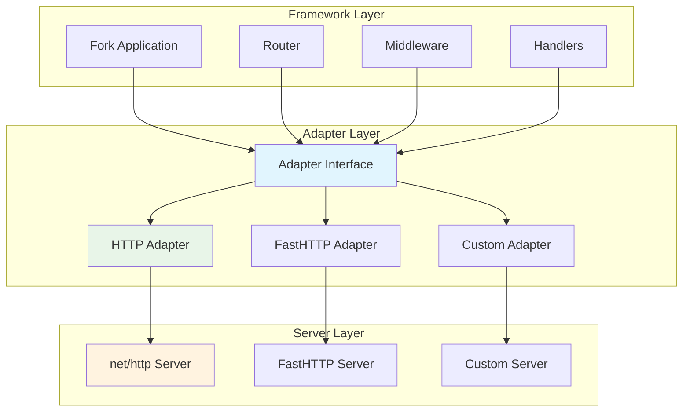
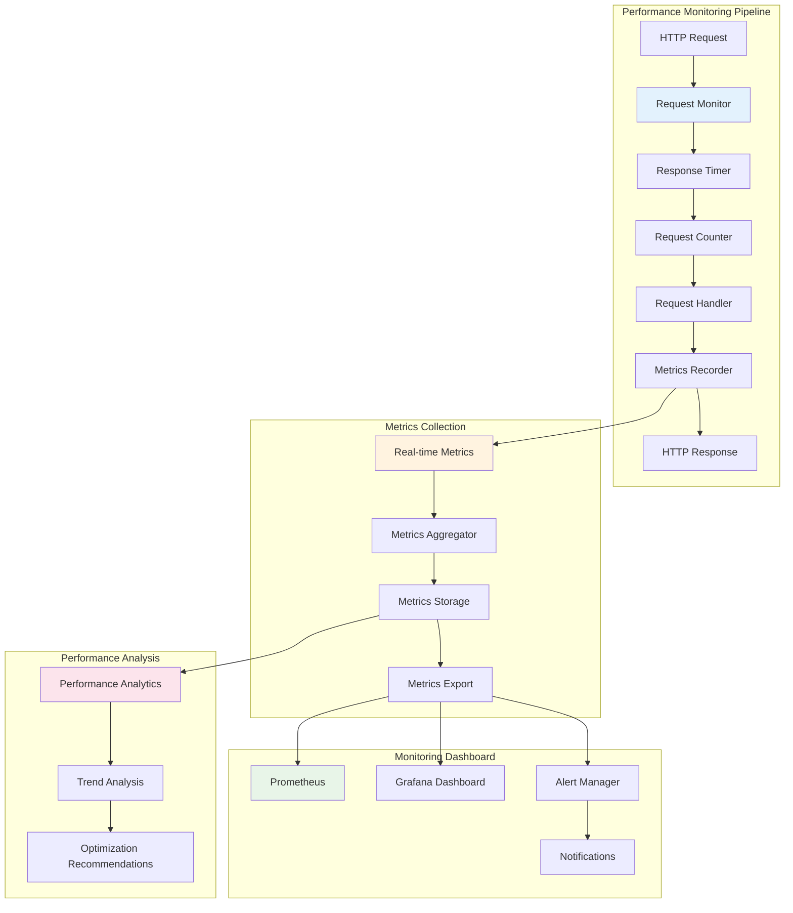
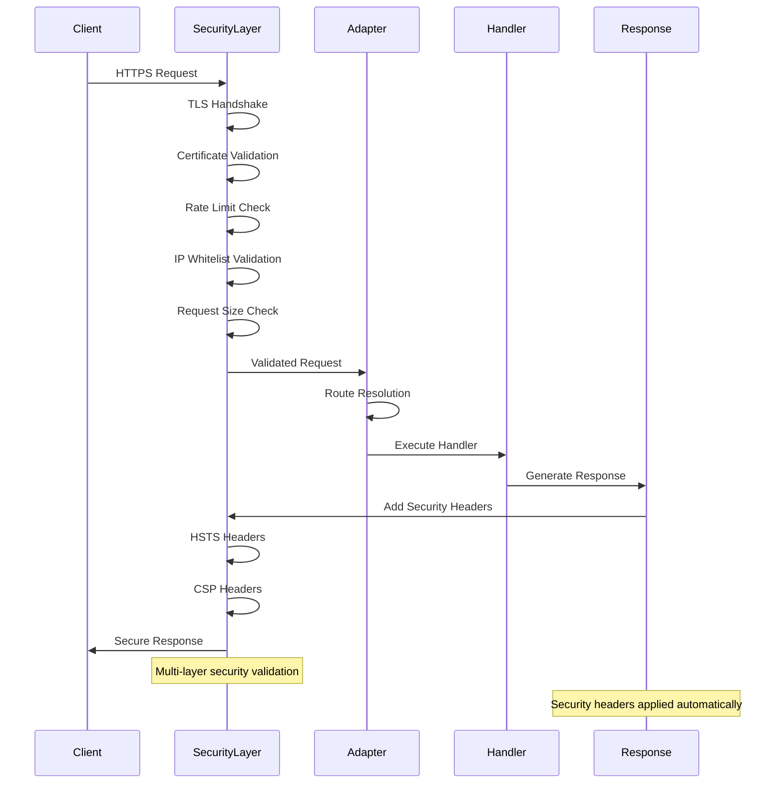

# Adapter - HTTP Server Abstraction Layer

Package `fork/adapter` cung cấp interface và implementations cho việc kết nối framework với các HTTP server khác nhau. Package này cho phép framework hoạt động trên nhiều server implementations khác nhau như net/http standard, fasthttp, và các server khác.

## 🏗️ Tổng quan kiến trúc

Adapter subsystem được thiết kế để tách biệt framework logic khỏi HTTP server implementation cụ thể:

- **Adapter Interface**: Contract chuẩn cho HTTP server abstractions
- **Server Independence**: Framework có thể hoạt động với bất kỳ HTTP server nào
- **Performance Optimization**: Tối ưu hóa cho từng server implementation
- **Graceful Shutdown**: Hỗ trợ shutdown an toàn cho production

### Sơ đồ kiến trúc Adapter


    IFACE --> WS
    
    HTTP --> CFG
    FAST --> CFG
    H2 --> CFG
    H3 --> CFG
    ## 🔧 Adapter Interface

Adapter interface định nghĩa contract chuẩn cho tất cả HTTP server implementations.

### Interface Definition

```go
type Adapter interface {
    // Name trả về tên của adapter
    Name() string
    
    // Serve khởi động HTTP server với cấu hình từ adapter
    Serve() error
    
    // RunTLS khởi động HTTPS server với chứng chỉ SSL/TLS
    RunTLS(certFile, keyFile string) error
    
    // ServeHTTP xử lý HTTP request (implements http.Handler)
    ServeHTTP(w http.ResponseWriter, r *http.Request)
    
    // HandleFunc đăng ký handler function với method và path
    HandleFunc(method, path string, handler func(ctx context.Context))
    
    // Use thêm middleware vào adapter
    Use(middleware func(ctx context.Context))
    
    // SetHandler thiết lập handler chính cho adapter
    SetHandler(handler http.Handler)
    
    // Shutdown đóng HTTP server một cách graceful
    Shutdown() error
}
    
    // Middleware ecosystem
    Use(middleware ...MiddlewareFunc)
    UseGlobal(middleware MiddlewareFunc)
    
    // Advanced configuration management
    SetConfig(config interface{}) error
    GetConfig() interface{}
    ```

### Core Methods

#### Server Lifecycle

```go
// Khởi động HTTP server
err := adapter.Serve()
if err != nil {
    log.Fatal("Failed to start server:", err)
}

// Khởi động HTTPS server
err := adapter.RunTLS("cert.pem", "key.pem")
if err != nil {
    log.Fatal("Failed to start TLS server:", err)
}

// Shutdown graceful
err := adapter.Shutdown()
if err != nil {
    log.Error("Error during shutdown:", err)
}
```

#### Handler Registration

```go
// Đăng ký handler function
adapter.HandleFunc("GET", "/api/users", func(ctx context.Context) {
    ctx.JSON(200, map[string]string{"message": "Users endpoint"})
})

// Thêm middleware
adapter.Use(func(ctx context.Context) {
    log.Println("Processing request:", ctx.Path())
    ctx.Next()
})

// Thiết lập handler chính
adapter.SetHandler(myCustomHandler)
```
  idle_timeout: 120s
  max_header_bytes: 1048576
  tls:
    enabled: false
    cert_file: "./certs/server.crt"
    key_file: "./certs/server.key"
```

## 🚀 Adapter Implementation Patterns

### Basic Adapter Structure

Mọi adapter implementation đều tuân theo pattern cơ bản:

```go
type BaseAdapter struct {
    name        string
    server      interface{}
    handler     http.Handler
    middlewares []func(context.Context)
    config      *AdapterConfig
}

func (a *BaseAdapter) Name() string {
    return a.name
}

func (a *BaseAdapter) Use(middleware func(ctx context.Context)) {
    a.middlewares = append(a.middlewares, middleware)
}

func (a *BaseAdapter) SetHandler(handler http.Handler) {
    a.handler = handler
}
```

### Configuration Structure

```go
type AdapterConfig struct {
    // Server settings
    Host            string        // Server host
    Port            int           // Server port
    ReadTimeout     time.Duration // Request read timeout
    WriteTimeout    time.Duration // Response write timeout
    IdleTimeout     time.Duration // Connection idle timeout
    
    // TLS settings
    TLSEnabled      bool          // Enable TLS/HTTPS
    CertFile        string        // Path to certificate file
    KeyFile         string        // Path to private key file
    
    // Performance settings
    MaxHeaderBytes  int           // Maximum header size
    MaxRequestSize  int64         // Maximum request body size
    KeepAlive       bool          // Enable keep-alive connections
    
    // Graceful shutdown
    ShutdownTimeout time.Duration // Graceful shutdown timeout
}
```
- Server push capabilities
- Multiplexing
- Header compression (HPACK)
- Flow control
- h2c support (HTTP/2 over cleartext)

**Configuration:**
```yaml
http2:
  addr: "localhost"
  port: 7669
  max_concurrent_streams: 250
  initial_window_size: 1048576
  max_frame_size: 16384
  h2c: true
  tls:
    enabled: true
    min_version: "1.2"
    max_version: "1.3"
```

### 4. QUIC/HTTP3 Adapter (`quic`)

Modern HTTP/3 over QUIC protocol:

```go
type QUICAdapter struct {
    server     *http3.Server
    config     *QUICConfig
    router     router.Router
    middleware []HandlerFunc
}
```

**Features:**
- HTTP/3 support
- QUIC transport protocol
- 0-RTT connection resumption
- Built-in encryption
- Improved performance over lossy networks
- UDP-based transport

**Configuration:**
```yaml
quic:
  addr: "localhost"
  ## 🛡️ Security Features

### TLS/SSL Support

```go
// Cấu hình TLS an toàn
type TLSConfig struct {
    CertFile            string              // Certificate file path
    KeyFile             string              // Private key file path
    MinVersion          uint16              // Minimum TLS version
    MaxVersion          uint16              // Maximum TLS version
    CipherSuites        []uint16            // Allowed cipher suites
    PreferServerCiphers bool                // Prefer server cipher order
    ClientAuth          tls.ClientAuthType  // Client authentication
}

func (a *Adapter) ConfigureTLS(config *TLSConfig) error {
    // Implementation TLS configuration
}
```

### Security Middleware

```go
// Security middleware cho adapter
func securityMiddleware(ctx context.Context) {
    // Security headers
    ctx.Header("X-Content-Type-Options", "nosniff")
    ctx.Header("X-Frame-Options", "DENY")
    ctx.Header("X-XSS-Protection", "1; mode=block")
    ctx.Header("Strict-Transport-Security", "max-age=31536000")
    
    ctx.Next()
}

// Áp dụng security middleware
adapter.Use(securityMiddleware)
```
    CertFile    string   `yaml:"cert_file"`
    KeyFile     string   `yaml:"key_file"`
    MinVersion  string   `yaml:"min_version"`
    MaxVersion  string   `yaml:"max_version"`
    CipherSuites []string `yaml:"cipher_suites"`
}
```

### Adapter-Specific Configurations

Each adapter extends base config với specific fields:

```go
// FastHTTP specific
type FastHTTPConfig struct {
    BaseConfig           `yaml:",inline"`
    MaxRequestBodySize   int  `yaml:"max_request_body_size"`
    Compression          bool `yaml:"compression"`
}

// HTTP/2 specific  
type HTTP2Config struct {
    BaseConfig            `yaml:",inline"`
    MaxConcurrentStreams  int `yaml:"max_concurrent_streams"`
    InitialWindowSize     int `yaml:"initial_window_size"`
    MaxFrameSize          int `yaml:"max_frame_size"`
    H2C                   bool `yaml:"h2c"`
}
```

## Usage Examples

### Basic HTTP Adapter

```go
func main() {
    // Tạo HTTP adapter
    config := &adapter.HTTPConfig{
        Addr: "localhost",
        Port: 8080,
        ReadTimeout: 10 * time.Second,
        WriteTimeout: 10 * time.Second,
    }
    
    httpAdapter := http.NewAdapter(config)
    
    // Tạo WebApp với adapter
    app := fork.NewWebApp()
    app.SetAdapter(httpAdapter)
    
    // Routes
    app.GET("/", func(c forkCtx.Context) {
        c.JSON(200, map[string]string{
            "message": "Hello from HTTP adapter",
        })
    })
    
    // Start server
    log.Fatal(app.Run())
}
```

### FastHTTP Adapter

```go
func main() {
    // FastHTTP configuration
    config := &adapter.FastHTTPConfig{
        BaseConfig: adapter.BaseConfig{
            Addr: "localhost",
            Port: 8080,
        },
        MaxRequestBodySize: 4 * 1024 * 1024, // 4MB
        Compression: true,
    }
    
    fastAdapter := fasthttp.NewAdapter(config)
    
    app := fork.NewWebApp()
    app.SetAdapter(fastAdapter)
    
    app.GET("/fast", func(c forkCtx.Context) {
        c.JSON(200, map[string]string{
            "message": "Hello from FastHTTP",
            "adapter": fastAdapter.Name(),
        })
    })
    
    log.Fatal(app.Run())
}
```

### HTTP/2 với TLS

```go
func main() {
    config := &adapter.HTTP2Config{
        BaseConfig: adapter.BaseConfig{
            Addr: "localhost",
            Port: 8443,
            TLS: adapter.TLSConfig{
                Enabled:  true,
                CertFile: "./certs/server.crt",
                KeyFile:  "./certs/server.key",
                MinVersion: "1.2",
                MaxVersion: "1.3",
            },
        },
        MaxConcurrentStreams: 250,
        InitialWindowSize: 1024 * 1024, // 1MB
        H2C: false, // Require TLS
    }
    
    http2Adapter := http2.NewAdapter(config)
    
    app := fork.NewWebApp()
    app.SetAdapter(http2Adapter)
    
    app.GET("/", func(c forkCtx.Context) {
        c.JSON(200, map[string]interface{}{
            "protocol": "HTTP/2",
            "tls": true,
        })
    })
    
    log.Fatal(app.RunTLS("", "")) // Uses config certs
}
```

### Unified Multi-Protocol

```go
func main() {
    config := &adapter.UnifiedConfig{
        PrimaryAddr: "localhost",
        HTTP: adapter.HTTPProtocolConfig{
            Enabled: true,
            Port: 8080,
        },
        HTTP2: adapter.HTTP2ProtocolConfig{
            Enabled: true,
            Port: 8443,
            H2CPort: 8081,
        },
        HTTP3: adapter.HTTP3ProtocolConfig{
            Enabled: true,
            Port: 9443,
        },
        TLS: adapter.TLSConfig{
            Enabled: true,
            CertFile: "./certs/unified.crt",
            KeyFile: "./certs/unified.key",
        },
    }
    
    unifiedAdapter := unified.NewAdapter(config)
    
    app := fork.NewWebApp()
    app.SetAdapter(unifiedAdapter)
    
    app.GET("/", func(c forkCtx.Context) {
        protocol := c.Request().Protocol()
        c.JSON(200, map[string]interface{}{
            "message": "Multi-protocol support",
            "protocol": protocol,
            "secure": c.Request().IsSecure(),
        })
    })
    
    log.Fatal(app.Run())
}
```

### Dynamic Adapter Selection

```go
func createAdapter(adapterType string) adapter.Adapter {
    switch adapterType {
    case "fasthttp":
        return fasthttp.NewAdapter(&adapter.FastHTTPConfig{
            BaseConfig: adapter.BaseConfig{
                Addr: "localhost",
                Port: 8080,
            },
            Compression: true,
        })
        
    case "http2":
        return http2.NewAdapter(&adapter.HTTP2Config{
            BaseConfig: adapter.BaseConfig{
                Addr: "localhost", 
                Port: 8443,
                TLS: adapter.TLSConfig{Enabled: true},
            },
            H2C: true,
        })
        
    default:
        return http.NewAdapter(&adapter.HTTPConfig{
            Addr: "localhost",
            Port: 8080,
        })
    }
}

func main() {
    adapterType := os.Getenv("HTTP_ADAPTER")
    if adapterType == "" {
        adapterType = "http"
    }
    
    selectedAdapter := createAdapter(adapterType)
    
    app := fork.NewWebApp()
    app.SetAdapter(selectedAdapter)
    
    log.Printf("Using %s adapter", selectedAdapter.Name())
    log.Fatal(app.Run())
}
```

## Performance Comparison

### Benchmarks

| Adapter | Requests/sec | Memory Usage | Features |
|---------|-------------|--------------|----------|
| HTTP | 50K | Medium | Standard, Stable |
| FastHTTP | 500K | Low | High Performance |
| HTTP/2 | 100K | Medium | Multiplexing, Push |
| QUIC/HTTP3 | 80K | Medium | Modern, 0-RTT |
| Unified | 200K | High | Multi-protocol |

### Use Cases

- **HTTP**: General purpose, development, legacy systems
- **FastHTTP**: High-performance APIs, microservices
- **HTTP/2**: Modern web applications, server push
- **QUIC/HTTP3**: Mobile apps, poor network conditions
- **Unified**: Enterprise applications, protocol migration

## Advanced Features

### Server Push (HTTP/2)

```go
app.GET("/", func(c forkCtx.Context) {
    // Check for HTTP/2 push support
    if pusher, ok := c.Response().Pusher(); ok {
        // Push CSS file
        pusher.Push("/static/style.css", &http.PushOptions{
            Method: "GET",
            Header: http.Header{
                "Content-Type": []string{"text/css"},
            },
        })
    }
    
    c.HTML(200, "index.html", nil)
})
```

### Connection Upgrading

```go
// WebSocket upgrade
app.GET("/ws", func(c forkCtx.Context) {
    if c.IsWebsocket() {
        // Handle WebSocket connection
        handleWebSocket(c)
    } else {
        c.JSON(400, map[string]string{
            "error": "WebSocket upgrade required",
        })
    }
})
```

### Custom Context Adaptation

```go
type FastHTTPContext struct {
    forkCtx.Context
    fastCtx *fasthttp.RequestCtx
}

func (c *FastHTTPContext) FastHTTPContext() *fasthttp.RequestCtx {
    return c.fastCtx
}
```

## 📈 Performance Monitoring & Metrics

### Enterprise Metrics Collection

```go
type AdapterPerformanceMonitor struct {
    metrics        *AdapterMetrics          // Real-time metrics
    collector      *MetricsCollector        // Data collection
    exporter       *MetricsExporter         // Metrics export (Prometheus, etc.)
    alertManager   *AlertManager            // Performance alerting
    dashboard      *MetricsDashboard        // Real-time dashboard
}

func (apm *AdapterPerformanceMonitor) CollectMetrics() *AdapterMetrics {
    return &AdapterMetrics{
        RequestCount:      atomic.LoadInt64(&apm.metrics.RequestCount),
        ActiveConnections: atomic.LoadInt64(&apm.metrics.ActiveConnections),
        AvgResponseTime:   apm.calculateAverageResponseTime(),
        ErrorRate:         apm.calculateErrorRate(),
        ThroughputRPS:     apm.calculateThroughput(),
        MemoryUsage:       apm.getMemoryUsage(),
        CPUUsage:          apm.getCPUUsage(),
        UptimeSeconds:     time.Since(apm.startTime).Nanoseconds() / 1e9,
    }
}

// Performance monitoring middleware
func (apm *AdapterPerformanceMonitor) MonitoringMiddleware() MiddlewareFunc {
    return func(next HandlerFunc) HandlerFunc {
        return func(c Context) {
            start := time.Now()
            
            // Record request
            atomic.AddInt64(&apm.metrics.RequestCount, 1)
            atomic.AddInt64(&apm.metrics.ActiveConnections, 1)
            
            // Process request
            next(c)
            
            // Record completion
            duration := time.Since(start)
            atomic.AddInt64(&apm.metrics.ActiveConnections, -1)
            apm.recordResponseTime(duration)
            
            // Check for errors
            if c.Response().Status() >= 400 {
                apm.recordError()
            }
        }
    }
}
```

### Performance Monitoring Architecture



## 🔒 Enterprise Security Features

### Advanced Security Configuration

```go
type AdapterSecurityConfig struct {
    // TLS/SSL configuration
    TLSConfig       *tls.Config              // TLS settings
    MinTLSVersion   uint16                   // Minimum TLS version
    CipherSuites    []uint16                 // Allowed cipher suites
    CertManager     *CertificateManager      // Certificate management
    
    // Request security
    MaxRequestSize  int64                    // Maximum request body size
    RateLimit       *RateLimitConfig         // Request rate limiting
    IPWhitelist     []net.IP                 // IP address restrictions
    
    // Advanced security features
    HSTS            *HSTSConfig              // HTTP Strict Transport Security
    CSP             *CSPConfig               // Content Security Policy
    CSRF            *CSRFConfig              // Cross-Site Request Forgery protection
    CORS            *CORSConfig              // Cross-Origin Resource Sharing
    
    // Security headers
    SecurityHeaders map[string]string        // Custom security headers
    HideServerInfo  bool                     // Hide server information
    EnableXSSFilter bool                     // XSS protection
}

// Certificate management với automatic renewal
type CertificateManager struct {
    certStore      *CertificateStore         // Certificate storage
    acmeClient     *ACMEClient              // Let's Encrypt integration
    renewalChecker *RenewalChecker           // Automatic renewal
    keyRotation    *KeyRotationManager       // Private key rotation
}

func (cm *CertificateManager) AutoRenewCertificates() {
    ticker := time.NewTicker(24 * time.Hour)
    defer ticker.Stop()
    
    for {
        select {
        case <-ticker.C:
            certs := cm.certStore.GetExpiringCertificates(30 * 24 * time.Hour)
            for _, cert := range certs {
                if err := cm.renewCertificate(cert); err != nil {
                    log.Printf("Certificate renewal failed: %v", err)
                }
            }
        }
    }
}
```

### Security Architecture Flow



## 🔧 Testing & Development

### Adapter Testing

```go
type AdapterTestSuite struct {
    adapter     adapter.Adapter
    testServer  *httptest.Server
    client      *http.Client
}

func NewAdapterTestSuite(adapter adapter.Adapter) *AdapterTestSuite {
    return &AdapterTestSuite{
        adapter:    adapter,
        testServer: httptest.NewServer(adapter),
        client:     &http.Client{Timeout: 10 * time.Second},
    }
}

func (ats *AdapterTestSuite) TestBasicRequest() {
    // Test basic HTTP request handling
    resp, err := ats.client.Get(ats.testServer.URL + "/test")
    assert.NoError(ats.T(), err)
    assert.Equal(ats.T(), 200, resp.StatusCode)
}

func (ats *AdapterTestSuite) TestMiddleware() {
    // Test middleware execution
    middlewareExecuted := false
    
    ats.adapter.Use(func(ctx context.Context) {
        middlewareExecuted = true
        ctx.Next()
    })
    
    ats.client.Get(ats.testServer.URL + "/test")
    assert.True(ats.T(), middlewareExecuted)
}
```

### Mock Adapter

```go
// Mock adapter cho testing
type MockAdapter struct {
    name        string
    requests    []*http.Request
    responses   []MockResponse
    middlewares []func(context.Context)
}

func (m *MockAdapter) Name() string {
    return m.name
}

func (m *MockAdapter) ServeHTTP(w http.ResponseWriter, r *http.Request) {
    m.requests = append(m.requests, r)
    
    // Simulate response
    if len(m.responses) > 0 {
        response := m.responses[0]
        w.WriteHeader(response.StatusCode)
        w.Write(response.Body)
    }
}

func (m *MockAdapter) GetRequests() []*http.Request {
    return m.requests
}
```
## Performance Considerations

### Adapter Performance Characteristics

| Feature | net/http | FastHTTP | Custom |
|---------|----------|----------|---------|
| Memory Allocation | Moderate | Low | Variable |
| Connection Handling | Standard | Optimized | Configurable |
| Request Parsing | Standard | Fast | Variable |
| Response Writing | Standard | Fast | Variable |
| Middleware Overhead | Low | Very Low | Variable |

### Optimization Strategies

```go
// Tối ưu hóa cho high-throughput
type HighPerformanceConfig struct {
    // Connection pooling
    MaxIdleConns        int
    MaxConnsPerHost     int
    IdleConnTimeout     time.Duration
    
    // Buffer management
    ReadBufferSize      int
    WriteBufferSize     int
    
    // Request handling
    DisableKeepAlives   bool
    MaxIdleConnsPerHost int
}

func NewOptimizedAdapter(config *HighPerformanceConfig) Adapter {
    // Implementation với performance optimizations
}
```

## 🚀 Production Deployment

### Graceful Shutdown Implementation

```go
func (a *BaseAdapter) GracefulShutdown(ctx context.Context) error {
    // Tạo channel để signal shutdown completion
    shutdownComplete := make(chan struct{})
    
    go func() {
        defer close(shutdownComplete)
        
        // Stop accepting new connections
        a.server.SetKeepAlivesEnabled(false)
        
        // Wait for existing connections to complete
        if err := a.server.Shutdown(ctx); err != nil {
            log.Error("Error during server shutdown:", err)
        }
    }()
    
    // Wait for shutdown to complete or timeout
    select {
    case <-shutdownComplete:
        log.Info("Server shutdown completed successfully")
        return nil
    case <-ctx.Done():
        log.Warn("Server shutdown timed out")
        return ctx.Err()
    }
}
```

### Health Checks

```go
// Health check middleware
func healthCheckMiddleware(ctx context.Context) {
    if ctx.Path() == "/health" {
        ctx.JSON(200, map[string]string{
            "status":    "healthy",
            "timestamp": time.Now().Format(time.RFC3339),
            "adapter":   ctx.Get("adapter_name").(string),
        })
        return
    }
    
    ctx.Next()
}

// Đăng ký health check
adapter.Use(healthCheckMiddleware)
```

## 📚 Tài liệu liên quan

- **[Web Application](web-application.md)** - Tích hợp adapter với WebApp
- **[Router](router.md)** - Router integration với adapter
- **[Context, Request & Response](context-request-response.md)** - Context handling trong adapter
- **[Configuration](config.md)** - Cấu hình adapter
- **[Testing](testing.md)** - Testing adapter implementations

## 💡 Best Practices

### Adapter Selection

```go
// Chọn adapter phù hợp cho use case
func selectAdapter(requirements *Requirements) adapter.Adapter {
    switch {
    case requirements.HighThroughput:
        return fasthttp.NewAdapter()
    case requirements.StandardCompliance:
        return nethttp.NewAdapter()
    case requirements.CustomProtocol:
        return custom.NewAdapter(requirements.Config)
    default:
        return nethttp.NewAdapter() // Default fallback
    }
}
```

### Error Handling

```go
// Robust error handling trong adapter
func (a *BaseAdapter) ServeHTTP(w http.ResponseWriter, r *http.Request) {
    defer func() {
        if err := recover(); err != nil {
            log.Error("Panic in adapter:", err)
            http.Error(w, "Internal Server Error", 500)
        }
    }()
    
    if a.handler == nil {
        http.Error(w, "No handler configured", 500)
        return
    }
    
    a.handler.ServeHTTP(w, r)
}
```

### Resource Management

```go
// Proper resource cleanup
func (a *BaseAdapter) Cleanup() {
    // Close connections
    if a.server != nil {
        a.server.Close()
    }
    
    // Clear middlewares
    a.middlewares = nil
    
    // Reset handler
    a.handler = nil
}
```

## 🔧 Ví dụ Usage

### Basic Adapter Setup

```go
package main

import (
    "context"
    "log"
    "net/http"
    
    "go.fork.vn/fork/adapter"
)

func main() {
    // Tạo adapter mới
    adapter := adapter.NewHTTPAdapter()
    
    // Cấu hình middleware
    adapter.Use(loggingMiddleware)
    adapter.Use(corsMiddleware)
    
    // Đăng ký handlers
    adapter.HandleFunc("GET", "/", homeHandler)
    adapter.HandleFunc("GET", "/health", healthHandler)
    
    // Khởi động server
    log.Println("Starting server on :8080")
    if err := adapter.Serve(); err != nil {
        log.Fatal("Server failed to start:", err)
    }
}

func homeHandler(ctx context.Context) {
    ctx.String(200, "Welcome to Fork Framework!")
}

func healthHandler(ctx context.Context) {
    ctx.JSON(200, map[string]string{
        "status": "healthy",
        "adapter": "http",
    })
}

func loggingMiddleware(ctx context.Context) {
    start := time.Now()
    ctx.Next()
    duration := time.Since(start)
    log.Printf("%s %s - %v", ctx.Method(), ctx.Path(), duration)
}
```

---

**Fork HTTP Framework Adapter** - HTTP server abstraction layer cho flexible deployment và performance optimization với support cho multiple server implementations.
