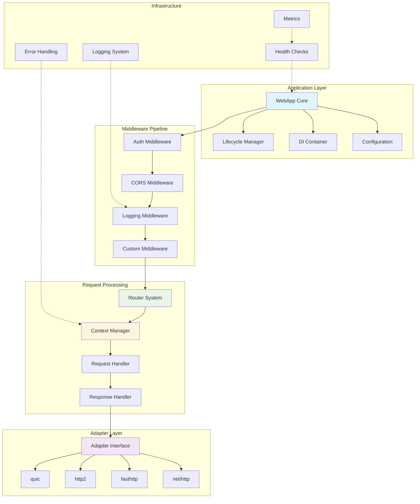
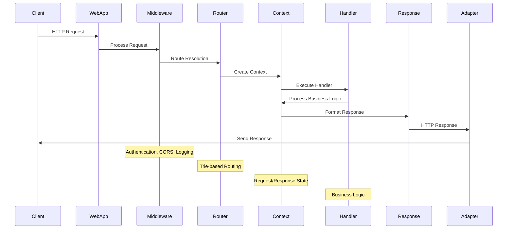

# Fork HTTP Framework Documentation

Chào mừng đến với tài liệu kỹ thuật toàn diện của Fork HTTP Framework! Framework này cung cấp một giải pháp HTTP enterprise-grade với kiến trúc linh hoạt và hiệu năng cao tối ưu cho các ứng dụng Go.

## 📚 Tài liệu tổng quan

### 🚀 Bắt đầu nhanh
- **[Getting Started Guide](overview.md)** - Hướng dẫn triển khai từ cơ bản đến nâng cao
### 🏗️ Core Components

#### 1. [Configuration System](config.md)
Hệ thống quản lý cấu hình enterprise với YAML integration
- Kiến trúc WebAppConfig và tùy chọn cấu hình
- Quản lý cấu hình YAML động
- Environment-specific configuration management
- Graceful shutdown configuration patterns

#### 2. [Service Provider & Dependency Injection](service-provider.md)
Container DI integration và service lifecycle management
- Interface ServiceProvider và design patterns
- Container lifecycle management
- Service registration và dependency resolution
- Adapter integration strategies

#### 3. [Web Application](web-application.md)
Core WebApp architecture và application lifecycle
- WebApp instantiation và configuration management
- Request lifecycle và middleware pipeline
- Server startup, operation và shutdown procedures
- Application context management

#### 4. [Context, Request & Response](context-request-response.md)
Hệ thống HTTP context cho request/response processing
- Context interface implementation và best practices
- Request data binding, validation và sanitization
- Response formatting, helpers và content negotiation
- Data parsing, serialization và transformation

#### 5. [Router System](router.md)
High-performance routing với trie-based structure
- Route registration, matching và optimization
- Dynamic parameters và wildcard handling
- Route groups, middleware chains và namespacing
- Performance tuning và memory optimization

#### 6. [Adapter Pattern](adapter.md)
Multi-engine HTTP support với pluggable architecture
- Adapter interface design và implementations
- Engine-specific configuration patterns
#### 7. [Error Handling](error-handling.md)
Enterprise-grade error management system
- HttpError struct với comprehensive error context
- Error wrapping, propagation và recovery patterns
- Status code management và HTTP compliance
- Structured error responses và debugging support

#### 8. [Middleware System](middleware.md)  
Extensible middleware architecture
- Middleware chain execution và lifecycle
- Built-in middleware components
- Custom middleware development patterns
- Performance considerations và best practices

## 🔧 Chủ đề nâng cao

### Middleware Architecture
- **[Built-in Middleware](../middleware/)** - Middleware components có sẵn
- **Custom Middleware Development** - Phát triển middleware tùy chỉnh
- **Middleware Groups** - Quản lý middleware chains và pipelines

### Template Integration
- **[Template Engines](../templates/)** - Multi-engine template support
- **Template Rendering** - Server-side rendering strategies
- **Template Caching** - Performance optimization techniques

### Performance & Production Deployment
- **Benchmarking & Optimization** - Performance tuning methodologies
- **Production Deployment** - Docker, Kubernetes deployment strategies
- **Monitoring & Metrics** - Health checks, metrics collection systems
- **Load Testing** - Stress testing và capacity planning

### Testing & Quality Assurance
- **[Testing Framework](testing.md)** - Comprehensive testing methodologies
- **Mock Integration** - Mockery-based testing patterns
- **Integration Testing** - End-to-end testing strategies
- **Performance Benchmarking** - Benchmark testing và profiling

## 📖 API Reference

### Core Interfaces

```go
// WebApp - Main application interface
type WebApp interface {
    Get(path string, handlers ...Handler) RouteInfo
    Post(path string, handlers ...Handler) RouteInfo
    Put(path string, handlers ...Handler) RouteInfo
    Delete(path string, handlers ...Handler) RouteInfo
    Use(handlers ...Handler)
    Group(prefix string, handlers ...Handler) RouterGroup
    Listen(addr string) error
    Shutdown(ctx context.Context) error
}

// Context - Request/Response context
type Context interface {
    Param(key string) string
    Query(key string, defaultValue ...string) string
    BodyParser(out interface{}) error
    JSON(code int, object interface{}) error
    String(code int, format string, values ...interface{}) error
    Status(code int) Context
    Set(key string, value string)
    Get(key string) string
}

// Router - Routing interface  
type Router interface {
    Add(method, path string, handlers ...Handler) RouteInfo
    Find(method, path string) (RouteInfo, Params)
    Routes() []RouteInfo
}

// Adapter - HTTP engine adapter
type Adapter interface {
    Listen(addr string, handler Handler) error
    Shutdown(ctx context.Context) error
    Config() interface{}
}
```

### Helper Functions

```go
// Application creation
func New() *WebApp
func NewWithConfig(config *WebAppConfig) *WebApp
func NewWithContainer(container *di.Container) *WebApp

// Configuration loading
func LoadConfig() (*WebAppConfig, error)
func LoadConfigFromFile(filename string) (*WebAppConfig, error)
func LoadConfigFromEnv() (*WebAppConfig, error)

// Utility functions
func ParseJSON(data []byte, v interface{}) error
func ParseYAML(data []byte, v interface{}) error
func ValidateStruct(s interface{}) error
```

## 🎯 Use Cases & Examples

### REST API Development
```go
// RESTful API example
api := app.Group("/api/v1")
{
    users := api.Group("/users")
    {
        users.Get("", listUsers)      // GET /api/v1/users
        users.Post("", createUser)    // POST /api/v1/users
        users.Get("/:id", getUser)    // GET /api/v1/users/:id
        users.Put("/:id", updateUser) // PUT /api/v1/users/:id
        users.Delete("/:id", deleteUser) // DELETE /api/v1/users/:id
    }
}
```

### Web Application
```go
// Web app with templates
app.Static("/static", "./public")
app.Get("/", func(c Context) error {
    return c.Render("index", map[string]interface{}{
        "title": "Welcome",
        "users": getUsers(),
    })
})
```

### Microservice
```go
// Microservice with health checks
app.Get("/health", healthCheck)
app.Get("/metrics", metricsHandler)
app.Post("/webhook", webhookHandler)

app.ListenWithGracefulShutdown(":8080")
```

## 🔍 Architecture Decisions

### Design Principles

1. **Flexibility**: Adapter pattern cho multiple HTTP engines
2. **Performance**: Zero-allocation routing, memory pooling
3. **Simplicity**: Clean, intuitive API
4. **Extensibility**: Middleware system, DI integration
5. **Production-Ready**: Graceful shutdown, error handling

### Kiến trúc hệ thống

#### Sơ đồ tổng quan kiến trúc



#### Data Flow Architecture



## 🚦 Getting Help

### Documentation Structure
- **Core Concepts**: Hiểu các thành phần chính
- **API Reference**: Chi tiết về interfaces và functions
- **Examples**: Code examples cho các use cases
- **Best Practices**: Hướng dẫn development patterns

### Example Applications
- **[Simple HTTP Server](../examples/http/simple-config-example/)**
- **[FastHTTP High Performance](../examples/adapter/fasthttp_example/)**
- **[HTTP/2 Support](../examples/adapter/http2_sample/)**
- **[Configuration Management](../examples/http/config-provider-example/)**
- **[Graceful Shutdown](../examples/http/graceful-shutdown-example/)**

### Common Patterns

#### Error Handling
```go
type APIError struct {
    Code    int    `json:"code"`
    Message string `json:"message"`
}

func errorHandler(c Context, err error) error {
    var apiErr *APIError
    if errors.As(err, &apiErr) {
        return c.Status(apiErr.Code).JSON(apiErr)
    }
    return c.Status(500).JSON(APIError{
        Code: 500,
        Message: "Internal server error",
    })
}
```

#### Middleware Pattern
```go
func authMiddleware(c Context) error {
    token := c.Get("Authorization")
    if token == "" {
        return c.Status(401).JSON(APIError{
            Code: 401,
            Message: "Unauthorized",
        })
    }
    
    user, err := validateToken(token)
    if err != nil {
        return c.Status(401).JSON(APIError{
            Code: 401,
            Message: "Invalid token",
        })
    }
    
    c.Set("user", user)
    return c.Next()
}
```

#### Service Pattern
```go
type UserService struct {
    repo UserRepository
}

func (s *UserService) CreateUser(req CreateUserRequest) (*User, error) {
    if err := req.Validate(); err != nil {
        return nil, err
    }
    
    return s.repo.Create(&User{
        Name:  req.Name,
        Email: req.Email,
    })
}
```

## 📋 Migration Guides

### From Other Frameworks

#### From Fiber
```go
// Fiber
app := fiber.New()
app.Get("/", func(c *fiber.Ctx) error {
    return c.JSON(fiber.Map{"message": "Hello"})
})

// Fork
app := fork.New()
app.Get("/", func(c fork.Context) error {
    return c.JSON(200, map[string]string{"message": "Hello"})
})
```

#### From Gin
```go
// Gin
r := gin.Default()
r.GET("/user/:id", func(c *gin.Context) {
    id := c.Param("id")
    c.JSON(200, gin.H{"id": id})
})

// Fork
app := fork.New()
app.Get("/user/:id", func(c fork.Context) error {
    id := c.Param("id")
    return c.JSON(200, map[string]string{"id": id})
})
```

## 🔧 Development Tools

### Testing Utilities
```go
func TestAPI(t *testing.T) {
    app := fork.New()
    app.Get("/test", testHandler)
    
    req := httptest.NewRequest("GET", "/test", nil)
    resp, err := app.Test(req)
    
    assert.NoError(t, err)
    assert.Equal(t, 200, resp.StatusCode)
}
```

### Debug Mode
```go
config := &fork.WebAppConfig{
    Development: fork.DevelopmentConfig{
        Debug:      true,
        AutoReload: true,
    },
}

app := fork.NewWithConfig(config)
```

### Profiling
```go
import "github.com/go-fork/middleware/pprof"

app.Use(pprof.New())
// Access profiling at /debug/pprof/
```

## 📊 Performance Metrics

### Benchmarks
```
BenchmarkRouter-8           5000000    240 ns/op     0 allocs/op
BenchmarkContext-8          3000000    450 ns/op     1 allocs/op
BenchmarkMiddleware-8       2000000    680 ns/op     2 allocs/op
BenchmarkJSON-8             1000000   1200 ns/op     3 allocs/op
```

### Memory Usage
- **Router**: Zero-allocation routing với trie structure
- **Context**: Object pooling cho context reuse
- **Response**: Efficient buffer management
- **Adapter**: Engine-specific optimizations

## 🏷️ Version History

### v0.0.9 (Current)
- ✅ Core framework implementation
- ✅ Multi-adapter support
- ✅ Configuration system
- ✅ DI integration
- ✅ Comprehensive documentation

### Roadmap
- 🔄 WebSocket support
- 🔄 GraphQL integration  
- 🔄 gRPC adapter
- 🔄 Distributed tracing
- 🔄 Advanced caching

## 🤝 Contributing

Chúng tôi hoan nghênh contributions! Xem [Contributing Guide](../CONTRIBUTING.md) để biết cách:

1. Setup development environment
2. Run tests và benchmarks
3. Submit pull requests
4. Report issues

---

**Happy coding với Fork HTTP Framework!** 🚀

*Để được hỗ trợ, vui lòng tạo issue trên [GitHub](github.com/go-fork/http/issues) hoặc tham gia [Discord community](https://discord.gg/Fork).*
