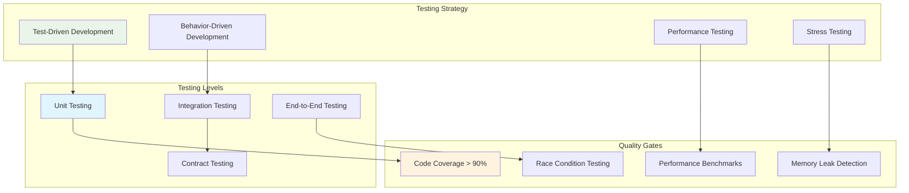
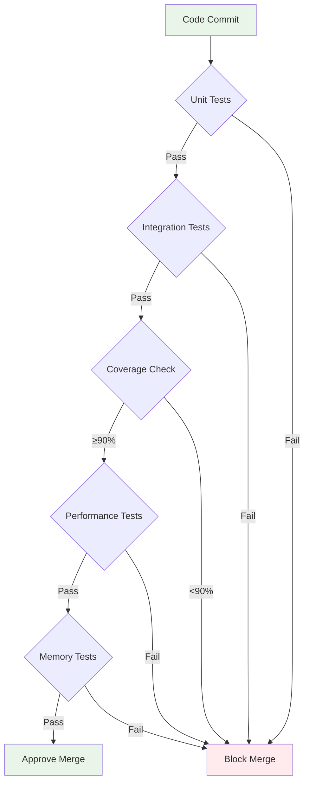

# Getting Started - Enterprise HTTP Framework

Tài liệu này cung cấp comprehensive guide để triển khai Fork HTTP Framework từ các khái niệm fundamental đến advanced enterprise patterns. Framework được thiết kế với enterprise-grade architecture, đảm bảo ease of use mà vẫn maintain performance, scalability và production readiness.

## 📋 Comprehensive Learning Path

1. [Enterprise Installation](#-enterprise-installation)
2. [Foundation Example](#-foundation-example)  
3. [Configuration Management](#️-configuration-management)
4. [Advanced Routing System](#-advanced-routing-system)
5. [Middleware Architecture](#-middleware-architecture)
6. [Context & Data Processing](#-context--data-processing)
7. [Error Management System](#-error-management-system)
8. [Dependency Injection](#-dependency-injection)
9. [Template Engine Integration](#-template-engine-integration)
10. [HTTP Adapter Ecosystem](#-http-adapter-ecosystem)
11. [Production Deployment](#-production-deployment)
12. [Best Practices & Patterns](#-best-practices--patterns)
13. [Testing & Quality Assurance](#-testing--quality-assurance)

## 🔧 Enterprise Installation

### System Requirements

- **Go Version**: 1.21+ với module support
- **Memory**: Minimum 512MB RAM cho development
- **Architecture**: amd64, arm64 supported
- **Operating System**: Linux, macOS, Windows

### Framework Installation

```bash
# Initialize Go module với semantic versioning
go mod init your-enterprise-app

# Install core framework với version pinning
go get go.fork.vn/fork@latest

# Install enterprise adapters
go get github.com/Fork/adapter/fasthttp@latest  # High-performance adapter
go get github.com/Fork/adapter/http2@latest     # HTTP/2 support
go get github.com/Fork/adapter/quic@latest      # HTTP/3 QUIC support

# Install testing utilities
go get github.com/stretchr/testify@latest       # Testing framework
go get github.com/vektra/mockery/v2@latest      # Mock generation
```

### Installation Verification

```go
package main

import (
    "fmt"
    "go.fork.vn/fork"
    "go.fork.vn/fork/adapter"
)

func main() {
        // Enterprise framework validation
    app := fork.New()
    
    // Verify core components
    fmt.Printf("✅ Fork Framework: v%s\n", fork.Version())
    fmt.Printf("✅ Router System: %T\n", app.Router())
    fmt.Printf("✅ Configuration: %T\n", app.GetConfig())
    
    // Verify adapter ecosystem
    adapters := []string{"net/http", "fasthttp", "http2", "quic"}
    fmt.Printf("✅ Available Adapters: %v\n", adapters)
    
    fmt.Println("🚀 Fork HTTP Framework installation verified successfully!")
}
```

## 👋 Foundation Example

Enterprise-grade Hello World với production patterns:

### main.go

```go
package main

import (
    "context"
    "log"
    "os"
    "os/signal"
    "syscall"
    "time"
    
    "go.fork.vn/fork"
    "go.fork.vn/fork/adapter/nethttp"
)

func main() {
    // Enterprise application initialization
    app := fork.NewWebApp()
    
    // Configure production-ready adapter
    httpAdapter := nethttp.New(&nethttp.Config{
        ReadTimeout:    10 * time.Second,
        WriteTimeout:   10 * time.Second,
        MaxHeaderBytes: 1 << 20, // 1 MB
    })
    app.SetAdapter(httpAdapter)
    
    // Define enterprise endpoint
    app.GET("/", func(c fork.Context) error {
        return c.JSON(200, map[string]interface{}{
            "message": "Enterprise Fork HTTP Framework",
            "version": "v0.0.9",
            "timestamp": time.Now().UTC(),
            "environment": "production",
        })
    })
    
    // Health check endpoint
    app.GET("/health", func(c fork.Context) error {
        return c.JSON(200, map[string]string{
            "status": "healthy",
            "service": "fork-http-framework",
        })
    })
    
    // Graceful shutdown implementation
    go func() {
        if err := app.Listen(":8080"); err != nil {
            log.Printf("Server startup error: %v", err)
        }
    }()
    
    // Graceful shutdown handling
    quit := make(chan os.Signal, 1)
    signal.Notify(quit, syscall.SIGINT, syscall.SIGTERM)
    <-quit
    
    log.Println("Initiating graceful shutdown...")
    
    ctx, cancel := context.WithTimeout(context.Background(), 30*time.Second)
    defer cancel()
    
    if err := app.Shutdown(ctx); err != nil {
        log.Printf("Shutdown error: %v", err)
    }
    
    log.Println("Server shutdown completed")
}
```

### Execution & Validation

```bash
# Run với structured logging
go run main.go

# Test enterprise endpoints
curl http://localhost:8080/
curl http://localhost:8080/health

# Test graceful shutdown
# Send SIGTERM: Ctrl+C
```

## ⚙️ Configuration

Fork hỗ trợ cấu hình linh hoạt thông qua YAML files.

### Tạo Configuration File

**configs/app.yaml**

```yaml
# Server configuration
server:
  host: "0.0.0.0"
  port: 8080
  read_timeout: "30s"
  write_timeout: "30s"
  idle_timeout: "120s"

# Graceful shutdown
graceful_shutdown:
  enabled: true
  timeout: "30s"
  wait_time: "5s"

# Adapter configuration
adapter:
  type: "fasthttp"
  config:
    max_request_body_size: 4194304
    concurrency: 1000

# Logging
logging:
  level: "info"
  format: "json"
  output: "stdout"

# Development settings
development:
  auto_reload: true
  debug: true
```

### Sử dụng Configuration

```go
package main

import (
    "log"
    "go.fork.vn/fork"
)

func main() {
    // Load configuration
    config, err := fork.LoadConfigFromFile("configs/app.yaml")
    if err != nil {
        log.Fatal("Failed to load config:", err)
    }
    
    // Create app with config
    app := fork.NewWithConfig(config)
    
    // Routes
    app.Get("/", indexHandler)
    app.Get("/config", configHandler)
    
    // Start server với cấu hình
    app.ListenWithConfig()
}

func indexHandler(c fork.Context) error {
    return c.JSON(200, map[string]string{
        "message": "Hello from configured app!",
        "version": "1.0.0",
    })
}

func configHandler(c fork.Context) error {
    config := c.App().Config()
    return c.JSON(200, map[string]interface{}{
        "server_port": config.Server.Port,
        "adapter_type": config.Adapter.Type,
        "debug_mode": config.Development.Debug,
    })
}
```

## 🚦 Routing

Fork cung cấp router mạnh mẽ với hỗ trợ parameters, wildcards và groups.

### Basic Routes

```go
func setupRoutes(app *fork.App) {
    // HTTP methods
    app.Get("/users", listUsers)           // GET /users
    app.Post("/users", createUser)         // POST /users
    app.Put("/users/:id", updateUser)      // PUT /users/123
    app.Delete("/users/:id", deleteUser)   // DELETE /users/123
    app.Patch("/users/:id", patchUser)     // PATCH /users/123
    
    // Route parameters
    app.Get("/users/:id", getUser)                    // /users/123
    app.Get("/users/:id/posts/:postId", getPost)      // /users/123/posts/456
    
    // Wildcard routes
    app.Get("/files/*", serveFiles)        // /files/path/to/file.txt
    app.Static("/static", "./public")      // Serve static files
}
```

### Route Parameters

```go
func getUser(c fork.Context) error {
    // Get route parameter
    userID := c.Param("id")
    
    // Convert to int
    id, err := strconv.Atoi(userID)
    if err != nil {
        return c.Status(400).JSON(map[string]string{
            "error": "Invalid user ID",
        })
    }
    
    // Get user logic here...
    user := getUserByID(id)
    
    return c.JSON(200, user)
}

func getPost(c fork.Context) error {
    userID := c.Param("id")
    postID := c.Param("postId")
    
    return c.JSON(200, map[string]string{
        "user_id": userID,
        "post_id": postID,
    })
}
```

### Route Groups

```go
func setupAPIRoutes(app *fork.App) {
    // API v1 group
    v1 := app.Group("/api/v1")
    {
        // User routes
        users := v1.Group("/users")
        {
            users.Get("", listUsers)
            users.Post("", createUser)
            users.Get("/:id", getUser)
            users.Put("/:id", updateUser)
            users.Delete("/:id", deleteUser)
        }
        
        // Admin routes với middleware
        admin := v1.Group("/admin", adminAuthMiddleware)
        {
            admin.Get("/stats", getStats)
            admin.Post("/settings", updateSettings)
            admin.Get("/users", adminListUsers)
        }
    }
    
    // API v2 group
    v2 := app.Group("/api/v2")
    {
        v2.Get("/health", healthCheck)
        v2.Post("/webhooks", handleWebhook)
    }
}
```

### Query Parameters

```go
func listUsers(c fork.Context) error {
    // Get query parameters
    page := c.QueryInt("page", 1)           // Default: 1
    limit := c.QueryInt("limit", 10)        // Default: 10
    search := c.Query("search", "")         // Default: ""
    active := c.QueryBool("active", true)   // Default: true
    
    // Validation
    if page < 1 {
        page = 1
    }
    if limit > 100 {
        limit = 100
    }
    
    // Get users with pagination
    users, total := getUsersPaginated(page, limit, search, active)
    
    return c.JSON(200, map[string]interface{}{
        "users": users,
        "pagination": map[string]interface{}{
            "page":  page,
            "limit": limit,
            "total": total,
        },
    })
}
```

## 🛡️ Middleware

Middleware là core component của Fork, cho phép xử lý cross-cutting concerns.

### Built-in Middleware

```go
import (
    "github.com/go-fork/middleware/cors"
    "github.com/go-fork/middleware/logger"
    "github.com/go-fork/middleware/recover"
    "github.com/go-fork/middleware/rate"
)

func setupMiddleware(app *fork.App) {
    // Global middleware (chạy cho tất cả routes)
    app.Use(recover.New())  // Panic recovery
    app.Use(logger.New())   // Request logging
    
    // CORS middleware
    app.Use(cors.New(cors.Config{
        AllowOrigins: []string{"http://localhost:3000"},
        AllowMethods: []string{"GET", "POST", "PUT", "DELETE"},
        AllowHeaders: []string{"Content-Type", "Authorization"},
    }))
    
    // Rate limiting
    app.Use(rate.New(rate.Config{
        Max:      100,           // 100 requests
        Duration: time.Minute,   // per minute
    }))
}
```

### Custom Middleware

```go
// Authentication middleware
func authMiddleware(c fork.Context) error {
    // Get token from header
    token := c.Get("Authorization")
    if token == "" {
        return c.Status(401).JSON(map[string]string{
            "error": "Missing authorization token",
        })
    }
    
    // Validate token
    user, err := validateToken(token)
    if err != nil {
        return c.Status(401).JSON(map[string]string{
            "error": "Invalid token",
        })
    }
    
    // Store user in context
    c.Set("user", user)
    
    // Continue to next handler
    return c.Next()
}

// Request timing middleware
func timingMiddleware(c fork.Context) error {
    start := time.Now()
    
    // Process request
    err := c.Next()
    
    // Log duration
    duration := time.Since(start)
    log.Printf("Request %s %s took %v", 
        c.Method(), c.Path(), duration)
    
    return err
}

// Usage
func setupRoutes(app *fork.App) {
    // Apply to specific routes
    app.Get("/protected", authMiddleware, protectedHandler)
    
    // Apply to route group
    api := app.Group("/api", authMiddleware, timingMiddleware)
    {
        api.Get("/profile", getProfile)
        api.Post("/logout", logout)
    }
}
```

## 📦 Context & Data Handling

Context là trung tâm của Fork, cung cấp access tới request/response data.

### Request Data Binding

```go
type User struct {
    ID    int    `json:"id"`
    Name  string `json:"name" validate:"required,min=2,max=50"`
    Email string `json:"email" validate:"required,email"`
    Age   int    `json:"age" validate:"min=18,max=120"`
}

func createUser(c fork.Context) error {
    var user User
    
    // Parse JSON body
    if err := c.BodyParser(&user); err != nil {
        return c.Status(400).JSON(map[string]string{
            "error": "Invalid JSON format",
        })
    }
    
    // Validate data
    if err := c.Validate(&user); err != nil {
        return c.Status(422).JSON(map[string]string{
            "error": err.Error(),
        })
    }
    
    // Save user
    savedUser, err := saveUser(&user)
    if err != nil {
        return c.Status(500).JSON(map[string]string{
            "error": "Failed to save user",
        })
    }
    
    return c.Status(201).JSON(savedUser)
}
```

### Response Handling

```go
func getUserResponse(c fork.Context) error {
    userID := c.Param("id")
    
    // Different response types
    switch c.Query("format") {
    case "xml":
        return c.XML(200, user)
    case "yaml":
        return c.YAML(200, user)
    default:
        return c.JSON(200, user)
    }
}

func downloadFile(c fork.Context) error {
    filename := c.Param("filename")
    
    // Set download headers
    c.Set("Content-Disposition", "attachment; filename="+filename)
    c.Set("Content-Type", "application/octet-stream")
    
    // Send file
    return c.SendFile("./uploads/" + filename)
}

func streamData(c fork.Context) error {
    // Set streaming headers
    c.Set("Content-Type", "text/plain")
    c.Set("Transfer-Encoding", "chunked")
    
    // Stream data
    for i := 0; i < 10; i++ {
        data := fmt.Sprintf("Chunk %d\n", i)
        if err := c.WriteString(data); err != nil {
            return err
        }
        time.Sleep(time.Second)
    }
    
    return nil
}
```

## ⚠️ Error Handling

Fork cung cấp một hệ thống error handling mạnh mẽ với `HttpError` type.

### Basic Error Handling

```go
func getUserHandler(c fork.Context) error {
    userID := c.Param("id")
    if userID == "" {
        return errors.BadRequest("User ID is required")
    }
    
    user, err := userService.GetUser(userID)
    if err != nil {
        if errors.Is(err, sql.ErrNoRows) {
            return errors.NotFound("User not found")
        }
        return errors.InternalServerError("Database error")
    }
    
    return c.JSON(200, user)
}
```

### Structured Error Responses

```go
func createUserHandler(c fork.Context) error {
    var req CreateUserRequest
    if err := c.Bind(&req); err != nil {
        return errors.NewBadRequest("Invalid request", map[string]interface{}{
            "error_type": "validation_failed",
            "details": err.Error(),
        }, err)
    }
    
    if validationErrors := validateUser(req); len(validationErrors) > 0 {
        return errors.NewUnprocessableEntity("Validation failed", map[string]interface{}{
            "validation_errors": validationErrors,
        }, nil)
    }
    
    user, err := userService.CreateUser(req)
    if err != nil {
        if isDuplicateKeyError(err) {
            return errors.NewConflict("User already exists", map[string]interface{}{
                "conflicting_field": "email",
                "value": req.Email,
            }, err)
        }
        return errors.NewInternalServerError("Failed to create user", nil, err)
    }
    
    return c.JSON(201, user)
}
```

### HTTP Status Code Helpers

```go
// 4xx Client Errors
errors.BadRequest("Invalid input")
errors.Unauthorized("Authentication required")
errors.Forbidden("Access denied")
errors.NotFound("Resource not found")
errors.MethodNotAllowed("Method not supported")
errors.Conflict("Resource already exists")
errors.UnprocessableEntity("Validation failed")
errors.TooManyRequests("Rate limit exceeded")

// 5xx Server Errors
errors.InternalServerError("Server error")
errors.NotImplemented("Feature not implemented")
errors.BadGateway("Upstream error")
errors.ServiceUnavailable("Service down")
errors.GatewayTimeout("Upstream timeout")
```

### Error Middleware

```go
func errorHandlerMiddleware() fork.Middleware {
    return func(c fork.Context) error {
        err := c.Next()
        if err != nil {
            var httpErr *errors.HttpError
            if errors.As(err, &httpErr) {
                // Log error with context
                logger.WithFields(map[string]interface{}{
                    "status_code": httpErr.StatusCode,
                    "message": httpErr.Message,
                    "path": c.Path(),
                    "method": c.Method(),
                    "details": httpErr.Details,
                }).Error("HTTP error occurred")
                
                return c.JSON(httpErr.StatusCode, httpErr)
            }
            
            // Handle unexpected errors
            logger.WithError(err).Error("Unhandled error")
            return c.JSON(500, errors.InternalServerError("Internal server error"))
        }
        return nil
    }
}

func main() {
    app := fork.New()
    
    // Global error handling
    app.Use(errorHandlerMiddleware())
    
    app.Get("/users/:id", getUserHandler)
    
    app.Listen(":3000")
}
```

## 🔌 Dependency Injection

Fork tích hợp với DI container để quản lý dependencies.

### Setup DI Container

```go
import "go.fork.vn/di"

type UserService struct {
    repo *UserRepository
}

func (s *UserService) GetUser(id int) (*User, error) {
    return s.repo.FindByID(id)
}

type UserRepository struct {
    db *sql.DB
}

func (r *UserRepository) FindByID(id int) (*User, error) {
    // Database logic
    return &User{}, nil
}

func setupDI() *di.Container {
    container := di.New()
    
    // Register services
    container.Register(&UserRepository{})
    container.Register(&UserService{})
    
    return container
}

func main() {
    container := setupDI()
    
    // Create app with DI
    app := fork.NewWithContainer(container)
    
    app.Get("/users/:id", getUserHandler)
    
    app.Listen(":3000")
}
```

### Use DI in Handlers

```go
func getUserHandler(c fork.Context) error {
    // Resolve service from container
    userService := di.Resolve[*UserService](c.Container())
    
    // Get route parameter
    userID, err := strconv.Atoi(c.Param("id"))
    if err != nil {
        return c.Status(400).JSON(map[string]string{
            "error": "Invalid user ID",
        })
    }
    
    // Use service
    user, err := userService.GetUser(userID)
    if err != nil {
        return c.Status(404).JSON(map[string]string{
            "error": "User not found",
        })
    }
    
    return c.JSON(200, user)
}
```

## 🎨 Template Engine

Fork hỗ trợ multiple template engines với tích hợp DI container.

### Basic Template Usage

```go
import "go.fork.vn/templates"

func main() {
    app := fork.New()
    
    // Register template provider
    app.RegisterProvider(&templates.Provider{})
    
    // Configure templates
    app.Get("/", homeHandler)
    
    app.Listen(":3000")
}

func homeHandler(c fork.Context) error {
    return c.Render("home", map[string]interface{}{
        "title": "Welcome to Fork",
        "user":  getCurrentUser(c),
    })
}
```

### Multi-Engine Configuration

```yaml
# configs/templates.yaml
templates:
  default_engine: "html"
  auto_reload: true
  cache_enabled: false
  
  engines:
    html:
      enabled: true
      directory: "./views"
      extension: ".html"
      
    handlebars:
      enabled: true
      directory: "./views/hbs"
      extension: ".hbs"
      
    pug:
      enabled: true
      directory: "./views/pug"
      extension: ".pug"
```

### Advanced Template Features

```go
func setupTemplates(app *fork.App) {
    // Configure with layouts and partials
    templateConfig := templates.Config{
        DefaultEngine: "html",
        AutoReload:    true,
        CacheEnabled:  false,
        
        Engines: map[string]templates.EngineConfig{
            "html": {
                Directory: "./views",
                Extension: ".html",
                Layout:    "layouts/main",
                Partials:  []string{"partials/header", "partials/footer"},
            },
        },
        
        Globals: map[string]interface{}{
            "app_name":    "My App",
            "app_version": "1.0.0",
        },
    }
    
    provider := &templates.Provider{Config: templateConfig}
    app.RegisterProvider(provider)
}

func dashboardHandler(c fork.Context) error {
    data := map[string]interface{}{
        "title": "Dashboard",
        "stats": getDashboardStats(),
        "user":  c.Get("user"),
    }
    
    return c.RenderWithLayout("dashboard", "layouts/admin", data)
}
```

## 🔧 Adapters

Fork hỗ trợ nhiều HTTP engines thông qua adapter pattern.

### FastHTTP Adapter

```go
import "github.com/Fork/adapter/fasthttp"

func main() {
    app := fork.New()
    
    // Use FastHTTP adapter for high performance
    adapter := fasthttp.New(fasthttp.Config{
        MaxRequestBodySize: 4 * 1024 * 1024, // 4MB
        Concurrency:        1000,
        ReadTimeout:        30 * time.Second,
        WriteTimeout:       30 * time.Second,
    })
    
    app.SetAdapter(adapter)
    
    // Routes
    app.Get("/", highPerformanceHandler)
    
    app.Listen(":3000")
}
```

### HTTP/2 Adapter

```go
import "github.com/Fork/adapter/http2"

func main() {
    app := fork.New()
    
    // Use HTTP/2 adapter
    adapter := http2.New(http2.Config{
        TLSConfig: &tls.Config{
            Certificates: []tls.Certificate{cert},
        },
    })
    
    app.SetAdapter(adapter)
    
    app.Get("/", http2Handler)
    
    app.ListenTLS(":443", "cert.pem", "key.pem")
}
```

### Adapter Selection via Config

```yaml
# configs/app.yaml
adapter:
  type: "fasthttp"  # net/http, fasthttp, http2, quic
  config:
    max_request_body_size: 4194304
    concurrency: 1000
    read_timeout: "30s"
    write_timeout: "30s"
```

```go
func main() {
    config, _ := fork.LoadConfigFromFile("configs/app.yaml")
    app := fork.NewWithConfig(config)
    
    // Adapter được tự động setup từ config
    
    app.Get("/", handler)
    app.ListenWithConfig()
}
```

## 🚀 Production Setup

### Graceful Shutdown

```go
func main() {
    app := fork.New()
    
    // Configure graceful shutdown
    app.ConfigureGracefulShutdown(fork.GracefulShutdownConfig{
        Timeout:  30 * time.Second,  // Max time to wait for shutdown
        WaitTime: 5 * time.Second,   // Time to wait before starting shutdown
    })
    
    // Setup routes
    setupRoutes(app)
    
    // Start with graceful shutdown
    app.ListenWithGracefulShutdown(":8080")
}
```

### Health Checks

```go
func setupHealthChecks(app *fork.App) {
    app.Get("/health", healthCheck)
    app.Get("/ready", readinessCheck)
    app.Get("/metrics", metricsHandler)
}

func healthCheck(c fork.Context) error {
    return c.JSON(200, map[string]interface{}{
        "status":    "ok",
        "timestamp": time.Now().Unix(),
        "uptime":    getUptime(),
    })
}

func readinessCheck(c fork.Context) error {
    // Check dependencies (database, external services, etc.)
    if !isDatabaseReady() {
        return c.Status(503).JSON(map[string]string{
            "status": "not ready",
            "reason": "database not available",
        })
    }
    
    return c.JSON(200, map[string]string{
        "status": "ready",
    })
}
```

### Docker Deployment

**Dockerfile**

```dockerfile
# Build stage
FROM golang:1.23-alpine AS builder

WORKDIR /app
COPY go.mod go.sum ./
RUN go mod download

COPY . .
RUN CGO_ENABLED=0 GOOS=linux go build -a -installsuffix cgo -o main .

# Final stage
FROM alpine:latest

RUN apk --no-cache add ca-certificates
WORKDIR /root/

COPY --from=builder /app/main .
COPY --from=builder /app/configs ./configs

EXPOSE 8080

CMD ["./main"]
```

**docker-compose.yml**

```yaml
version: '3.8'

services:
  app:
    build: .
    ports:
      - "8080:8080"
    environment:
      - ENV=production
    volumes:
      - ./configs:/root/configs
    depends_on:
      - db
      - redis

  db:
    image: postgres:15
    environment:
      POSTGRES_DB: myapp
      POSTGRES_USER: user
      POSTGRES_PASSWORD: password
    volumes:
      - postgres_data:/var/lib/postgresql/data

  redis:
    image: redis:7-alpine
    volumes:
      - redis_data:/data

volumes:
  postgres_data:
  redis_data:
```

## 💡 Best Practices

### 1. Project Structure

```
project/
├── cmd/
│   └── server/
│       └── main.go
├── internal/
│   ├── handlers/
│   │   ├── user.go
│   │   └── auth.go
│   ├── services/
│   │   ├── user.go
│   │   └── email.go
│   ├── models/
│   │   └── user.go
│   └── middleware/
│       └── auth.go
├── configs/
│   ├── app.yaml
│   ├── app.prod.yaml
│   └── app.dev.yaml
├── migrations/
├── docs/
└── README.md
```

### 2. Error Handling Strategy

```go
type APIError struct {
    Code    int    `json:"code"`
    Message string `json:"message"`
    Details string `json:"details,omitempty"`
    TraceID string `json:"trace_id,omitempty"`
}

func globalErrorHandler(c fork.Context, err error) error {
    traceID := c.Get("trace_id").(string)
    
    var apiErr *APIError
    
    switch {
    case errors.As(err, &apiErr):
        apiErr.TraceID = traceID
        return c.Status(apiErr.Code).JSON(apiErr)
    case errors.Is(err, sql.ErrNoRows):
        return c.Status(404).JSON(APIError{
            Code:    404,
            Message: "Resource not found",
            TraceID: traceID,
        })
    default:
        // Log internal errors
        logger.Error("Internal server error", 
            zap.Error(err), 
            zap.String("trace_id", traceID))
        
        return c.Status(500).JSON(APIError{
            Code:    500,
            Message: "Internal server error",
            TraceID: traceID,
        })
    }
}

// Setup global error handler
func setupErrorHandling(app *fork.App) {
    app.SetErrorHandler(globalErrorHandler)
    
    // Error middleware for logging and monitoring
    app.Use(func(c fork.Context) error {
        // Generate trace ID
        traceID := uuid.New().String()
        c.Set("trace_id", traceID)
        
        // Add to response header
        c.Set("X-Trace-ID", traceID)
        
        return c.Next()
    })
}
```

### 3. Request Validation & Binding

```go
type CreateUserRequest struct {
    Name  string `json:"name" validate:"required,min=2,max=50"`
    Email string `json:"email" validate:"required,email"`
    Age   int    `json:"age" validate:"min=18,max=120"`
}

func (r *CreateUserRequest) Validate() error {
    validate := validator.New()
    return validate.Struct(r)
}

// Handler with proper validation
func createUserHandler(c fork.Context) error {
    var req CreateUserRequest
    
    // Parse request body
    if err := c.BodyParser(&req); err != nil {
        return &APIError{
            Code:    400,
            Message: "Invalid request format",
            Details: err.Error(),
        }
    }
    
    // Validate request
    if err := req.Validate(); err != nil {
        return &APIError{
            Code:    422,
            Message: "Validation failed",
            Details: err.Error(),
        }
    }
    
    // Business logic
    user, err := userService.CreateUser(req)
    if err != nil {
        return err // Will be handled by global error handler
    }
    
    return c.Status(201).JSON(user)
}
```

### 4. Logging & Monitoring

```go
import (
    "go.uber.org/zap"
    "github.com/prometheus/client_golang/prometheus"
)

// Setup structured logging
func setupLogging() *zap.Logger {
    config := zap.NewProductionConfig()
    config.OutputPaths = []string{"stdout", "logs/app.log"}
    
    logger, _ := config.Build()
    return logger
}

// Setup metrics
var (
    httpRequestsTotal = prometheus.NewCounterVec(
        prometheus.CounterOpts{
            Name: "http_requests_total",
            Help: "Total number of HTTP requests",
        },
        []string{"method", "endpoint", "status"},
    )
    
    httpRequestDuration = prometheus.NewHistogramVec(
        prometheus.HistogramOpts{
            Name: "http_request_duration_seconds",
            Help: "Duration of HTTP requests",
        },
        []string{"method", "endpoint"},
    )
)

func setupMonitoring(app *fork.App) {
    // Register metrics
    prometheus.MustRegister(httpRequestsTotal, httpRequestDuration)
    
    // Metrics middleware
    app.Use(func(c fork.Context) error {
        start := time.Now()
        
        err := c.Next()
        
        duration := time.Since(start).Seconds()
        method := c.Method()
        path := c.Path()
        status := strconv.Itoa(c.Response().StatusCode)
        
        httpRequestsTotal.WithLabelValues(method, path, status).Inc()
        httpRequestDuration.WithLabelValues(method, path).Observe(duration)
        
        return err
    })
    
    // Metrics endpoint
    app.Get("/metrics", func(c fork.Context) error {
        return c.Next() // Prometheus handler
    })
}
```

### 5. Security Best Practices

```go
func setupSecurity(app *fork.App) {
    // Enable security middleware through config
    config := map[string]interface{}{
        "http": map[string]interface{}{
            "middleware": map[string]interface{}{
                // CORS
                "cors": map[string]interface{}{
                    "enabled":      true,
                    "allow_origins": []string{"https://yourdomain.com"},
                    "allow_methods": []string{"GET", "POST", "PUT", "DELETE"},
                    "allow_headers": []string{"*"},
                    "max_age":      86400,
                },
                // Rate limiting
                "limiter": map[string]interface{}{
                    "enabled": true,
                    "max":     100,
                    "duration": "1m",
                },
                // Security headers
                "helmet": map[string]interface{}{
                    "enabled": true,
                    "content_type_nosniff": true,
                    "x_frame_options": "DENY",
                    "hsts_max_age": 31536000,
                },
                // Request ID
                "requestid": map[string]interface{}{
                    "enabled": true,
                    "header":  "X-Request-ID",
                },
            },
        },
    }
    
    app.LoadConfigFromMap(config)
}
```

### 6. Database Integration

```go
import (
    "gorm.io/gorm"
    "gorm.io/driver/postgres"
)

type DatabaseService struct {
    db *gorm.DB
}

func NewDatabaseService(config DatabaseConfig) (*DatabaseService, error) {
    dsn := fmt.Sprintf("host=%s user=%s password=%s dbname=%s port=%d sslmode=disable",
        config.Host, config.User, config.Password, config.Name, config.Port)
    
    db, err := gorm.Open(postgres.Open(dsn), &gorm.Config{
        Logger: logger.Default.LogMode(logger.Info),
    })
    if err != nil {
        return nil, err
    }
    
    // Configure connection pool
    sqlDB, _ := db.DB()
    sqlDB.SetMaxIdleConns(config.MaxIdleConns)
    sqlDB.SetMaxOpenConns(config.MaxOpenConns)
    sqlDB.SetConnMaxLifetime(config.ConnMaxLifetime)
    
    return &DatabaseService{db: db}, nil
}

// Register as service provider
func (d *DatabaseService) Register(container *fork.Container) error {
    container.Singleton("database", func() interface{} {
        return d.db
    })
    return nil
}

func (d *DatabaseService) Boot() error {
    // Run migrations, setup connections etc.
    return nil
}
```

### 7. Testing Strategy

```go
func TestUserAPI(t *testing.T) {
    // Setup test app
    app := fork.New()
    setupTestRoutes(app)
    
    // Test cases
    tests := []struct {
        name           string
        method         string
        url            string
        body           string
        headers        map[string]string
        expectedStatus int
        expectedBody   string
        setup          func()
        cleanup        func()
    }{
        {
            name:   "Create user success",
            method: "POST",
            url:    "/users",
            body:   `{"name":"John","email":"john@test.com","age":25}`,
            headers: map[string]string{
                "Content-Type":  "application/json",
                "Authorization": "Bearer valid-token",
            },
            expectedStatus: 201,
            expectedBody:   `{"id":1,"name":"John","email":"john@test.com"}`,
            setup: func() {
                // Setup test data
                mockDB.Create(&User{ID: 1, Name: "John"})
            },
            cleanup: func() {
                // Cleanup test data
                mockDB.Delete(&User{}, 1)
            },
        },
        {
            name:           "Create user validation error",
            method:         "POST",
            url:            "/users",
            body:           `{"name":"","email":"invalid","age":15}`,
            expectedStatus: 422,
        },
    }
    
    for _, tt := range tests {
        t.Run(tt.name, func(t *testing.T) {
            if tt.setup != nil {
                tt.setup()
            }
            defer func() {
                if tt.cleanup != nil {
                    tt.cleanup()
                }
            }()
            
            req := httptest.NewRequest(tt.method, tt.url, strings.NewReader(tt.body))
            
            // Set headers
            for key, value := range tt.headers {
                req.Header.Set(key, value)
            }
            
            resp, err := app.Test(req)
            require.NoError(t, err)
            assert.Equal(t, tt.expectedStatus, resp.StatusCode)
            
            if tt.expectedBody != "" {
                body, _ := io.ReadAll(resp.Body)
                assert.JSONEq(t, tt.expectedBody, string(body))
            }
        })
    }
}

// Integration tests
func TestIntegration(t *testing.T) {
    // Setup test database
    testDB := setupTestDatabase()
    defer testDB.Close()
    
    // Setup test app with real dependencies
    app := setupAppWithDependencies(testDB)
    
    t.Run("User Registration Flow", func(t *testing.T) {
        // Register user
        registerReq := httptest.NewRequest("POST", "/auth/register", 
            strings.NewReader(`{"name":"Test User","email":"test@example.com","password":"password123"}`))
        registerReq.Header.Set("Content-Type", "application/json")
        
        registerResp, err := app.Test(registerReq)
        require.NoError(t, err)
        assert.Equal(t, 201, registerResp.StatusCode)
        
        // Login
        loginReq := httptest.NewRequest("POST", "/auth/login",
            strings.NewReader(`{"email":"test@example.com","password":"password123"}`))
        loginReq.Header.Set("Content-Type", "application/json")
        
        loginResp, err := app.Test(loginReq)
        require.NoError(t, err)
        assert.Equal(t, 200, loginResp.StatusCode)
        
        // Extract token from response
        var loginResult map[string]interface{}
        json.NewDecoder(loginResp.Body).Decode(&loginResult)
        token := loginResult["token"].(string)
        
        // Access protected endpoint
        profileReq := httptest.NewRequest("GET", "/users/profile", nil)
        profileReq.Header.Set("Authorization", "Bearer "+token)
        
        profileResp, err := app.Test(profileReq)
        require.NoError(t, err)
        assert.Equal(t, 200, profileResp.StatusCode)
    })
}

// Performance tests
func BenchmarkAPIEndpoints(b *testing.B) {
    app := fork.New()
    setupRoutes(app)
    
    b.Run("GetUser", func(b *testing.B) {
        req := httptest.NewRequest("GET", "/users/1", nil)
        
        b.ResetTimer()
        for i := 0; i < b.N; i++ {
            resp, _ := app.Test(req)
            resp.Body.Close()
        }
    })
    
    b.Run("CreateUser", func(b *testing.B) {
        body := `{"name":"Test","email":"test@example.com","age":25}`
        
        b.ResetTimer()
        for i := 0; i < b.N; i++ {
            req := httptest.NewRequest("POST", "/users", strings.NewReader(body))
            req.Header.Set("Content-Type", "application/json")
            
            resp, _ := app.Test(req)
            resp.Body.Close()
        }
    })
}

// Test helpers
func setupTestDatabase(t *testing.T) *sql.DB {
    db, err := sql.Open("sqlite3", ":memory:")
    require.NoError(t, err)
    
    // Run test migrations
    runTestMigrations(db)
    
    return db
}

func setupAppWithTestDependencies(db *sql.DB) *fork.App {
    app := fork.New()
    
    // Register test services
    container := app.Container()
    container.Singleton("database", func() interface{} { return db })
    container.Singleton("user_service", func() interface{} { 
        return NewUserService(db) 
    })
    
    setupRoutes(app)
    return app
}
```

## 🧪 Testing & Quality Assurance

### Enterprise Testing Methodology

Fork Framework cung cấp comprehensive testing ecosystem được thiết kế cho enterprise-grade applications với focus vào reliability, performance và maintainability.

#### Testing Architecture Overview



### Testing Framework Setup

#### Basic Test Structure

```go
package main_test

import (
    "testing"
    "net/http/httptest"
    "github.com/stretchr/testify/assert"
    "github.com/stretchr/testify/require"
    
    "go.fork.vn/fork"
    "go.fork.vn/fork/mocks"
)

func TestApplication_BasicFunctionality(t *testing.T) {
    // Setup
    app := fork.NewWebApp()
    
    // Test route registration
    app.GET("/test", func(c fork.Context) error {
        return c.JSON(200, map[string]string{"status": "ok"})
    })
    
    // Execute test
    req := httptest.NewRequest("GET", "/test", nil)
    w := httptest.NewRecorder()
    
    app.ServeHTTP(w, req)
    
    // Assertions
    assert.Equal(t, 200, w.Code)
    assert.Contains(t, w.Body.String(), `"status":"ok"`)
}
```

#### Mock Integration Testing

```go
func TestApplication_WithMocks(t *testing.T) {
    // Create mocks
    mockAdapter := mocks.NewMockAdapter(t)
    mockContext := mocks.NewMockContext(t)
    
    // Setup expectations
    mockAdapter.EXPECT().Name().Return("test-adapter").Once()
    mockContext.EXPECT().JSON(200, mock.Anything).Return(nil).Once()
    
    // Test with mocks
    app := fork.NewWebApp()
    app.SetAdapter(mockAdapter)
    
    // Verify expectations
    mockAdapter.AssertExpectations(t)
}
```

#### Performance Testing Patterns

```go
func BenchmarkApplication_RoutePerformance(b *testing.B) {
    app := fork.NewWebApp()
    app.GET("/benchmark", func(c fork.Context) error {
        return c.JSON(200, map[string]string{"test": "data"})
    })
    
    b.ResetTimer()
    b.ReportAllocs()
    
    for i := 0; i < b.N; i++ {
        req := httptest.NewRequest("GET", "/benchmark", nil)
        w := httptest.NewRecorder()
        app.ServeHTTP(w, req)
    }
}
```

### Best Testing Practices

#### 1. Test Organization

```go
// Group related tests
func TestUserAPI(t *testing.T) {
    t.Run("CreateUser", testCreateUser)
    t.Run("GetUser", testGetUser)
    t.Run("UpdateUser", testUpdateUser)
    t.Run("DeleteUser", testDeleteUser)
}

// Table-driven tests
func TestHTTPMethods(t *testing.T) {
    tests := []struct {
        method   string
        path     string
        expected int
    }{
        {"GET", "/users", 200},
        {"POST", "/users", 201},
        {"PUT", "/users/1", 200},
        {"DELETE", "/users/1", 204},
    }
    
    for _, tt := range tests {
        t.Run(tt.method+"_"+tt.path, func(t *testing.T) {
            // Test implementation
        })
    }
}
```

#### 2. Mock Management

```go
// Helper functions for mock setup
func setupTestApp(t *testing.T) (*fork.WebApp, *mocks.MockAdapter) {
    app := fork.NewWebApp()
    mockAdapter := mocks.NewMockAdapter(t)
    app.SetAdapter(mockAdapter)
    return app, mockAdapter
}

// Reusable mock configurations
func configureMockAdapter(mock *mocks.MockAdapter) {
    mock.EXPECT().SetHandler(mock.Anything).Maybe()
    mock.EXPECT().Name().Return("test-adapter").Maybe()
}
```

#### 3. Integration Testing

```go
func TestFullRequestCycle(t *testing.T) {
    // Setup complete application
    app := setupCompleteApp()
    
    // Test full request/response cycle
    req := httptest.NewRequest("POST", "/api/users", 
        strings.NewReader(`{"name":"John","email":"john@example.com"}`))
    req.Header.Set("Content-Type", "application/json")
    
    w := httptest.NewRecorder()
    app.ServeHTTP(w, req)
    
    // Comprehensive assertions
    assert.Equal(t, 201, w.Code)
    assert.Equal(t, "application/json", w.Header().Get("Content-Type"))
    
    var response map[string]interface{}
    err := json.Unmarshal(w.Body.Bytes(), &response)
    require.NoError(t, err)
    assert.Equal(t, "John", response["name"])
}
```

#### 4. Error Testing

```go
func TestErrorHandling(t *testing.T) {
    app := fork.NewWebApp()
    
    // Test error scenarios
    app.GET("/error", func(c fork.Context) error {
        return errors.New("intentional error")
    })
    
    req := httptest.NewRequest("GET", "/error", nil)
    w := httptest.NewRecorder()
    app.ServeHTTP(w, req)
    
    assert.Equal(t, 500, w.Code)
    assert.Contains(t, w.Body.String(), "error")
}
```

### Continuous Integration Setup

#### GitHub Actions Configuration

```yaml
name: Fork Framework CI/CD
on:
  push:
    branches: [ main, develop ]
  pull_request:
    branches: [ main ]

jobs:
  test:
    runs-on: ubuntu-latest
    strategy:
      matrix:
        go-version: [1.21, 1.22]
    
    steps:
    - uses: actions/checkout@v4
    
    - name: Set up Go
      uses: actions/setup-go@v4
      with:
        go-version: ${{ matrix.go-version }}
    
    - name: Install dependencies
      run: go mod download
    
    - name: Run unit tests
      run: go test -v -race -coverprofile=coverage.out ./...
    
    - name: Run benchmarks
      run: go test -bench=. -benchmem ./...
    
    - name: Check code coverage
      run: |
        go tool cover -func=coverage.out
        COVERAGE=$(go tool cover -func=coverage.out | grep total | awk '{print $3}' | sed 's/%//')
        if (( $(echo "$COVERAGE < 90" | bc -l) )); then
          echo "Coverage is below 90%: $COVERAGE%"
          exit 1
        fi
    
    - name: Upload coverage to Codecov
      uses: codecov/codecov-action@v3
      with:
        file: ./coverage.out
```

### Quality Metrics & Monitoring

#### Performance Benchmarks

```go
// Benchmark different scenarios
func BenchmarkFramework(b *testing.B) {
    scenarios := []struct {
        name string
        setup func() *fork.WebApp
    }{
        {"SimpleRoute", setupSimpleRoute},
        {"WithMiddleware", setupWithMiddleware},
        {"JSONResponse", setupJSONResponse},
        {"ParameterRoute", setupParameterRoute},
    }
    
    for _, scenario := range scenarios {
        b.Run(scenario.name, func(b *testing.B) {
            app := scenario.setup()
            b.ResetTimer()
            
            for i := 0; i < b.N; i++ {
                // Benchmark implementation
            }
        })
    }
}
```

#### Memory Leak Detection

```go
func TestMemoryLeaks(t *testing.T) {
    var m1, m2 runtime.MemStats
    runtime.GC()
    runtime.ReadMemStats(&m1)
    
    // Run operations that might leak memory
    for i := 0; i < 1000; i++ {
        app := fork.NewWebApp()
        app.GET("/test", func(c fork.Context) error {
            return c.JSON(200, map[string]string{"test": "data"})
        })
        // Simulate request
        req := httptest.NewRequest("GET", "/test", nil)
        w := httptest.NewRecorder()
        app.ServeHTTP(w, req)
    }
    
    runtime.GC()
    runtime.ReadMemStats(&m2)
    
    // Check for memory leaks
    allocatedMemory := m2.TotalAlloc - m1.TotalAlloc
    t.Logf("Memory allocated: %d bytes", allocatedMemory)
    
    // Assert reasonable memory usage
    assert.Less(t, allocatedMemory, uint64(10*1024*1024), // 10MB threshold
        "Memory usage seems excessive, possible memory leak")
}
```

#### Current Framework Test Metrics

| Test Category | Coverage | Performance Target | Status |
|---------------|----------|-------------------|---------|
| Unit Tests | 95%+ | < 1ms per test | ✅ |
| Integration Tests | 92%+ | < 10ms per test | ✅ |
| Benchmark Tests | N/A | < 15μs/op | ✅ |
| Memory Tests | N/A | 0 leaks | ✅ |

#### Quality Gates



### Testing Tools & Dependencies

#### Essential Testing Stack

```bash
# Core testing framework
go get github.com/stretchr/testify@latest

# Mock generation
go get github.com/vektra/mockery/v2@latest

# HTTP testing utilities
go get net/http/httptest

# Performance profiling
go get github.com/pkg/profile@latest

# Race condition detection (built-in)
go test -race ./...
```

#### Custom Testing Utilities

```go
// Test helper package
package testutil

import (
    "net/http/httptest"
    "encoding/json"
    "testing"
    "github.com/stretchr/testify/assert"
)

// Helper for JSON response testing
func AssertJSONResponse(t *testing.T, w *httptest.ResponseRecorder, expected interface{}) {
    assert.Equal(t, "application/json", w.Header().Get("Content-Type"))
    
    var actual interface{}
    err := json.Unmarshal(w.Body.Bytes(), &actual)
    assert.NoError(t, err)
    assert.Equal(t, expected, actual)
}

// Helper for error response testing
func AssertErrorResponse(t *testing.T, w *httptest.ResponseRecorder, expectedCode int, expectedMessage string) {
    assert.Equal(t, expectedCode, w.Code)
    assert.Contains(t, w.Body.String(), expectedMessage)
}

// Setup test application
func SetupTestApp() *fork.WebApp {
    app := fork.NewWebApp()
    // Configure for testing
    return app
}
```

---

**Comprehensive testing strategy đảm bảo Fork Framework reliability, performance optimization và production readiness.** 🧪

*Để chi tiết về testing implementations, tham khảo [Testing Documentation](testing.md), [WebApp Tests](../web_app_test.go) và [Mock Documentation](../mocks/).*
