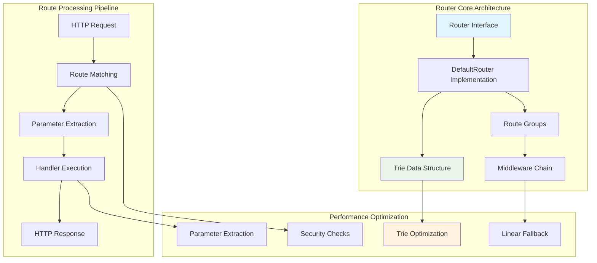
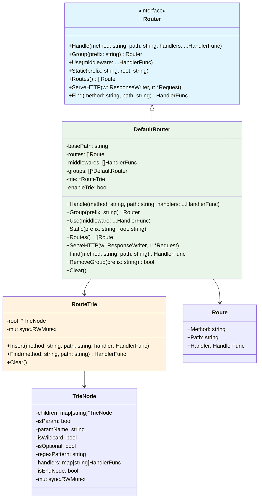
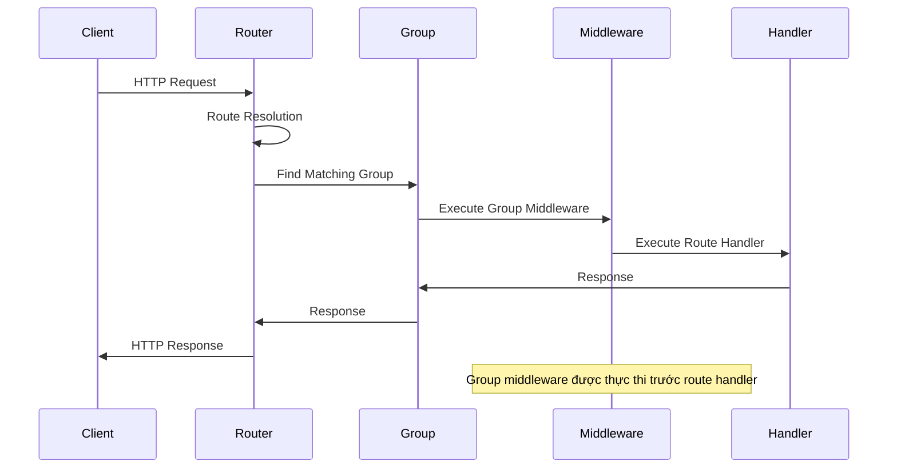

# Router - Hệ thống định tuyến HTTP

Package `fork/router` cung cấp hệ thống routing hiệu suất cao cho Fork HTTP Framework. Router engine sử dụng cấu trúc dữ liệu trie được tối ưu hóa để đảm bảo hiệu suất tra cứu nhanh và khả năng khớp pattern toàn diện.

## 🏗️ Tổng quan kiến trúc

Router subsystem được thiết kế với khả năng mở rộng và tối ưu hóa hiệu suất:

- **Router Interface**: Contract routing chuẩn hóa với implementations có thể thay thế
- **DefaultRouter**: Implementation sẵn sàng production với tối ưu hóa dựa trên trie
- **Route Groups**: Tổ chức route theo cấu trúc phân cấp với namespace isolation
- **Middleware Integration**: Thực thi middleware chain hiệu quả
- **Pattern Matching**: Dynamic parameters, wildcards, regex patterns với type safety

### Sơ đồ kiến trúc Router



## 🔧 Router Interface

Router interface định nghĩa contract chuẩn cho HTTP routing trong framework.

### Phương thức cốt lõi

```go
type Router interface {
    // Handle đăng ký một handler cho method và path cụ thể
    Handle(method string, path string, handlers ...HandlerFunc)
    
    // Group tạo một router group mới với prefix đường dẫn
    Group(prefix string) Router
    
    // Use thêm middleware vào router
    Use(middleware ...HandlerFunc)
    
    // Static phục vụ static files từ thư mục root
    Static(prefix string, root string)
    
    // Routes trả về tất cả routes đã đăng ký
    Routes() []Route
    
    // ServeHTTP implements interface http.Handler
    ServeHTTP(w http.ResponseWriter, req *http.Request)
    
    // Find tìm route phù hợp với method và path
    Find(method, path string) HandlerFunc
}
```

### Route Structure

```go
type Route struct {
    Method  string      // HTTP method (GET, POST, PUT, DELETE, v.v.)
    Path    string      // URL path pattern của route
    Handler HandlerFunc // Function xử lý requests khớp với route này
}
```

### Handler Function

```go
type HandlerFunc func(ctx context.Context)
```

## 🚀 DefaultRouter Implementation

DefaultRouter là implementation mặc định của Router interface, cung cấp cơ chế routing dựa trên path patterns với hỗ trợ cho parameters, wildcards, và regex patterns.

### Cấu trúc DefaultRouter

```go
type DefaultRouter struct {
    basePath    string             // Tiền tố đường dẫn cho tất cả routes
    routes      []Route            // Danh sách các routes đã đăng ký
    middlewares []HandlerFunc      // Danh sách middleware functions
    groups      []*DefaultRouter   // Danh sách các sub-routers (groups)
    trie        *RouteTrie         // Trie cho việc tìm kiếm route nhanh
    enableTrie  bool               // Bật/tắt việc sử dụng trie (mặc định: true)
}
```

### Tạo Router mới

```go
func NewRouter() Router {
    return &DefaultRouter{
        basePath:    "",
        routes:      make([]Route, 0),
        middlewares: make([]HandlerFunc, 0),
        groups:      make([]*DefaultRouter, 0),
        trie:        NewRouteTrie(),
        enableTrie:  true,
    }
}
```

### Kiến trúc Router Class



## 🎯 Route Pattern Matching

### Các loại Route Patterns

Router hỗ trợ nhiều loại patterns khác nhau:

#### 1. Static Routes
```go
router.Handle("GET", "/api/health", healthHandler)
router.Handle("POST", "/api/users", createUserHandler)
```

#### 2. Named Parameters
```go
// Single parameter
router.Handle("GET", "/users/:id", getUserHandler)

// Multiple parameters  
router.Handle("GET", "/users/:id/posts/:postId", getPostHandler)
```

#### 3. Optional Parameters
```go
// Optional version parameter
router.Handle("GET", "/api/:version?/users", listUsersHandler)
```

#### 4. Wildcard Parameters
```go
// Catch-all wildcard
router.Handle("GET", "/files/*filepath", serveFileHandler)
```

#### 5. Regex Constraints
```go
// Parameter với regex constraint
router.Handle("GET", "/users/:id<\\d+>", getUserByIdHandler)
```

### Parameter Extraction

```go
func getUserHandler(ctx context.Context) {
    userID := ctx.Param("id")
    // Xử lý với userID
}

func getFileHandler(ctx context.Context) {
    filepath := ctx.Param("filepath")
    // Xử lý với filepath
}
```

## 🔗 Route Groups

Route Groups cho phép tổ chức routes theo cấu trúc phân cấp và áp dụng middleware chung.

### Tạo Route Groups

```go
// Tạo API group với prefix
api := router.Group("/api")

// Thêm middleware cho group
api.Use(authMiddleware)
api.Use(loggingMiddleware)

// Đăng ký routes trong group
api.Handle("GET", "/users", listUsersHandler)
api.Handle("POST", "/users", createUserHandler)

// Tạo nested groups
v1 := api.Group("/v1")
v1.Handle("GET", "/posts", listPostsHandler)

v2 := api.Group("/v2")
v2.Handle("GET", "/posts", listPostsV2Handler)
```

### Group Management

```go
// Xóa group để tránh memory leaks
router.RemoveGroup("/api/v1")

// Clear tất cả resources
router.Clear()
```

### Group Architecture Flow



## 📁 Static File Serving

Router cung cấp khả năng phục vụ static files với các tính năng bảo mật.

### Đăng ký Static Routes

```go
// Phục vụ static files từ thư mục
router.Static("/static", "./public")
router.Static("/assets", "./assets")
```

### Security Features

Router tự động bảo vệ khỏi path traversal attacks:

```go
func (r *DefaultRouter) Static(prefix string, root string) {
    absolutePath := r.calculateAbsolutePath(prefix)
    handler := func(ctx Context) {
        path := ctx.Path()
        if strings.HasPrefix(path, absolutePath) {
            relativePath := strings.TrimPrefix(path, absolutePath)
            
            // Ngăn chặn path traversal
            if strings.Contains(relativePath, "..") {
                ctx.Status(http.StatusForbidden)
                ctx.String(http.StatusForbidden, "403 Forbidden")
                return
            }
            
            // Đảm bảo path an toàn
            if !strings.HasPrefix(relativePath, "/") {
                relativePath = "/" + relativePath
            }
            
            filePath := root + relativePath
            
            // Kiểm tra bảo mật bổ sung
            if !strings.HasPrefix(filePath, root) {
                ctx.Status(http.StatusForbidden)
                ctx.String(http.StatusForbidden, "403 Forbidden")
                return
            }
            
            ctx.File(filePath)
        }
    }
    r.Handle("GET", prefix+"/*filepath", handler)
}
```

## ⚡ Trie Optimization

Router sử dụng cấu trúc dữ liệu Trie để tối ưu hóa hiệu suất tra cứu route.

### TrieNode Structure

```go
type TrieNode struct {
    children     map[string]*TrieNode  // Các node con
    isParam      bool                  // Node này có phải là parameter không
    paramName    string                // Tên parameter
    isWildcard   bool                  // Node này có phải là wildcard không
    isOptional   bool                  // Parameter có optional không
    regexPattern string                // Regex constraint cho parameter
    handlers     map[string]HandlerFunc // Handlers theo HTTP method
    isEndNode    bool                  // Đây có phải là node cuối không
    mu           sync.RWMutex          // Bảo vệ truy cập đồng thời
}
```

### RouteTrie Implementation

```go
type RouteTrie struct {
    root *TrieNode
    mu   sync.RWMutex
}

func NewRouteTrie() *RouteTrie {
    return &RouteTrie{
        root: &TrieNode{
            children: make(map[string]*TrieNode),
            handlers: make(map[string]HandlerFunc),
        },
    }
}
```

### Trie Performance

- **Insertion**: O(k) với k = độ dài path
- **Lookup**: O(k) với k = độ dài path  
- **Memory**: Efficient với shared prefixes
- **Concurrency**: Thread-safe với RWMutex

## 🔍 Route Resolution Process

### Route Finding Algorithm

Router sử dụng thuật toán hybrid để tìm routes:

1. **Trie Search** (ưu tiên): O(k) lookup
2. **Linear Fallback**: Khi trie không khả dụng

```go
func (r *DefaultRouter) findRoute(method, path string) *Route {
    // Sử dụng trie search nếu được bật
    if r.enableTrie && r.trie != nil {
        if handler := r.trie.Find(method, path); handler != nil {
            // Tìm route tương ứng trong danh sách routes
            for _, route := range r.routes {
                if route.Method == method && r.pathMatch(route.Path, path) {
                    return &route
                }
            }
        }
    }
    
    // Fallback to linear search
    for _, route := range r.routes {
        if route.Method == method && r.pathMatch(route.Path, path) {
            return &route
        }
    }
    
    // Kiểm tra trong các groups
    for _, group := range r.groups {
        if route := group.findRoute(method, path); route != nil {
            return route
        }
    }
    
    return nil
}
```

### Parameter Extraction Process

```go
func (r *DefaultRouter) extractParams(pattern, path string) map[string]string {
    params := make(map[string]string)
    
    patternSegments := r.splitPath(pattern)
    pathSegments := r.splitPath(path)
    
    // Xử lý wildcard
    wildcardIndex := -1
    for i, segment := range patternSegments {
        if strings.HasPrefix(segment, "*") {
            wildcardIndex = i
            break
        }
    }
    
    // Xử lý optional parameters
    // Xử lý named parameters
    // Xử lý regex constraints
    
    return params
}
```

## 💡 Best Practices

### Route Organization

```go
// ✅ Tốt: Cấu trúc route có tổ chức
func setupRoutes(router Router) {
    // API routes
    api := router.Group("/api")
    api.Use(authMiddleware)
    
    v1 := api.Group("/v1")
    {
        users := v1.Group("/users")
        users.Handle("GET", "", listUsers)
        users.Handle("POST", "", createUser)
        users.Handle("GET", "/:id", getUser)
        users.Handle("PUT", "/:id", updateUser)
        users.Handle("DELETE", "/:id", deleteUser)
        
        posts := v1.Group("/posts")
        posts.Handle("GET", "", listPosts)
        posts.Handle("POST", "", createPost)
    }
    
    // Static files
    router.Static("/static", "./public")
}

// ❌ Không tốt: Cấu trúc route phẳng
router.Handle("GET", "/api/v1/users", listUsers)
router.Handle("POST", "/api/v1/users", createUser)
router.Handle("GET", "/api/v1/users/:id", getUser)
// ... nhiều routes khác
```

### Middleware Ordering

```go
// ✅ Tốt: Thứ tự middleware hợp lý
router.Use(corsMiddleware)        // CORS trước tiên
router.Use(compressionMiddleware) // Compression cho tất cả responses
router.Use(authMiddleware)        // Auth khi cần thiết
router.Use(loggingMiddleware)     // Logging cuối cùng

// ❌ Không tốt: Thứ tự middleware không hiệu quả
router.Use(heavyProcessingMiddleware) // Middleware nặng trước
router.Use(compressionMiddleware)     // Middleware nhẹ sau
```

### Memory Management

```go
// ✅ Tốt: Sử dụng param hiệu quả
func getUserHandler(ctx Context) {
    userID := ctx.Param("id")
    // Xử lý trực tiếp userID
}

// ❌ Không tốt: Cấp phát bộ nhớ không cần thiết
func getUserHandler(ctx Context) {
    params := make(map[string]string)
    params["id"] = ctx.Param("id")
    // Cấp phát map không cần thiết
}
```

## 📚 Tài liệu liên quan

- **[Web Application](web-application.md)** - Tích hợp WebApp với router
- **[Context, Request & Response](context-request-response.md)** - Sử dụng context system
- **[Middleware](middleware.md)** - Phát triển và tích hợp middleware
- **[Error Handling](error-handling.md)** - Quản lý lỗi trong routing
- **[Configuration](config.md)** - Tùy chọn cấu hình router
- **[Testing](testing.md)** - Framework testing toàn diện

## 🔧 Ví dụ Usage

### Basic Router Setup

```go
package main

import (
    "go.fork.vn/fork/router"
    "go.fork.vn/fork/context"
)

func main() {
    // Tạo router mới
    r := router.NewRouter()
    
    // Đăng ký middleware
    r.Use(loggingMiddleware)
    r.Use(authMiddleware)
    
    // Đăng ký routes
    r.Handle("GET", "/", homeHandler)
    r.Handle("GET", "/health", healthHandler)
    
    // API routes
    api := r.Group("/api/v1")
    api.Handle("GET", "/users", listUsersHandler)
    api.Handle("GET", "/users/:id", getUserHandler)
    api.Handle("POST", "/users", createUserHandler)
    
    // Static files
    r.Static("/static", "./public")
    
    // Khởi động server
    log.Fatal(http.ListenAndServe(":8080", r))
}

func homeHandler(ctx context.Context) {
    ctx.String(200, "Welcome to Fork Framework!")
}

func healthHandler(ctx context.Context) {
    ctx.JSON(200, map[string]string{
        "status": "ok",
        "version": "1.0.0",
    })
}

func getUserHandler(ctx context.Context) {
    userID := ctx.Param("id")
    ctx.JSON(200, map[string]string{
        "id": userID,
        "name": "User " + userID,
    })
}
```

---

**Fork HTTP Framework Router** - Hệ thống routing hiệu suất cao cho Go web applications với tính năng toàn diện, bảo mật nâng cao, và patterns scalability production-ready.
