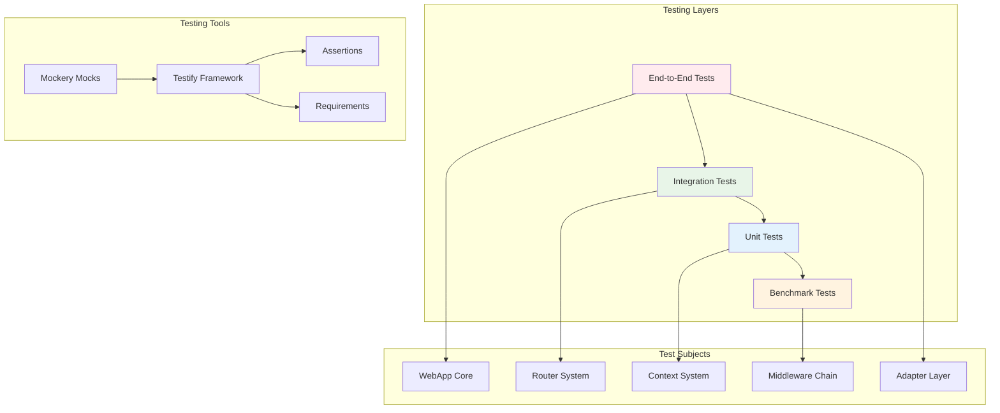
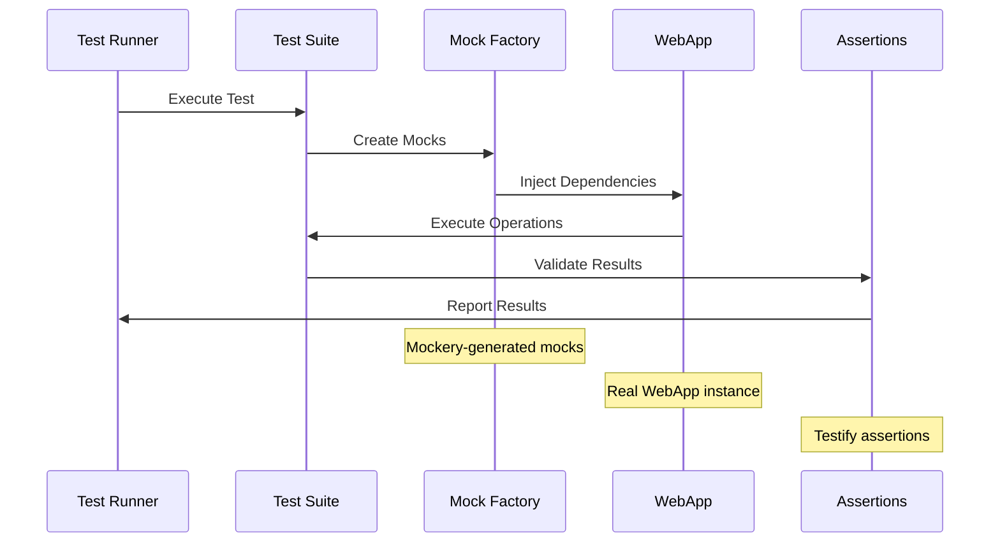
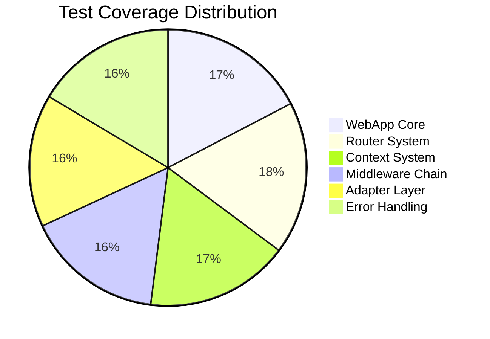
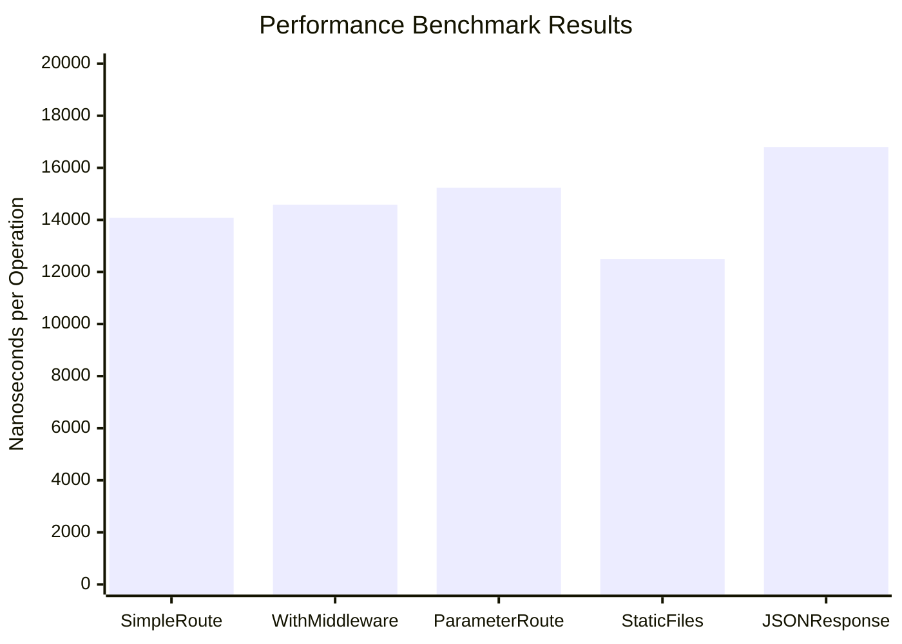
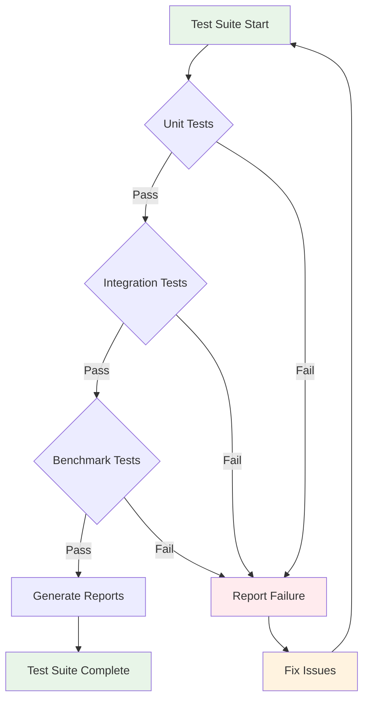

# Testing Framework Documentation

Tài liệu này mô tả hệ thống kiểm thử toàn diện của Fork HTTP Framework, bao gồm methodologies, patterns và tools để đảm bảo chất lượng code.

## 📋 Tổng quan Testing Framework

Fork HTTP Framework cung cấp một testing ecosystem hoàn chỉnh với:

- **Unit Testing**: Kiểm thử từng component độc lập
- **Integration Testing**: Kiểm thử tương tác giữa các components
- **Mock Testing**: Sử dụng mockery để isolate dependencies
- **Performance Testing**: Benchmark testing và profiling
- **End-to-End Testing**: Kiểm thử complete request flows

## 🏗️ Kiến trúc Testing

### Testing Stack Overview



### Test Flow Architecture



## 🧪 Test Categories

### 1. Unit Tests

Unit tests kiểm thử từng component riêng biệt với mocked dependencies.

#### WebApp Core Tests
```go
func TestWebApp_NewWebApp(t *testing.T) {
    app := NewWebApp()
    
    assert.NotNil(t, app)
    assert.NotNil(t, app.router)
    assert.NotNil(t, app.config)
    assert.Nil(t, app.adapter)
}
```

#### Configuration Tests
```go
func TestWebApp_SetAdapter(t *testing.T) {
    app := NewWebApp()
    mockAdapter := mocks.NewMockAdapter(t)
    
    mockAdapter.EXPECT().SetHandler(mock.AnythingOfType("*router.DefaultRouter")).Once()
    
    app.SetAdapter(mockAdapter)
    assert.Equal(t, mockAdapter, app.adapter)
}
```

### 2. Integration Tests

Integration tests kiểm thử tương tác giữa multiple components.

#### Router-Context Integration
```go
func TestWebApp_RouterContextIntegration(t *testing.T) {
    app := NewWebApp()
    mockAdapter := mocks.NewMockAdapter(t)
    
    app.SetAdapter(mockAdapter)
    
    var capturedHandler http.HandlerFunc
    mockAdapter.EXPECT().SetHandler(mock.Anything).Run(func(handler http.HandlerFunc) {
        capturedHandler = handler
    }).Once()
    
    app.GET("/test/:id", func(c Context) error {
        id := c.Param("id")
        return c.JSON(200, map[string]string{"id": id})
    })
    
    // Test the integration
    req := httptest.NewRequest("GET", "/test/123", nil)
    w := httptest.NewRecorder()
    
    capturedHandler(w, req)
    
    assert.Equal(t, 200, w.Code)
    assert.Contains(t, w.Body.String(), `"id":"123"`)
}
```

### 3. Middleware Chain Tests

Kiểm thử middleware execution flow và abort mechanisms.

#### Middleware Execution
```go
func TestWebApp_MiddlewareChain(t *testing.T) {
    app := NewWebApp()
    var executionOrder []string
    
    middleware1 := func(c Context) error {
        executionOrder = append(executionOrder, "middleware1")
        return c.Next()
    }
    
    middleware2 := func(c Context) error {
        executionOrder = append(executionOrder, "middleware2")
        return c.Next()
    }
    
    handler := func(c Context) error {
        executionOrder = append(executionOrder, "handler")
        return c.JSON(200, map[string]string{"message": "success"})
    }
    
    app.Use(middleware1)
    app.Use(middleware2)
    app.GET("/test", handler)
    
    // Execute and verify order
    expected := []string{"middleware1", "middleware2", "handler"}
    assert.Equal(t, expected, executionOrder)
}
```

#### Middleware Abort Testing
```go
func TestWebApp_MiddlewareAbort(t *testing.T) {
    app := NewWebApp()
    var executionOrder []string
    
    abortMiddleware := func(c Context) error {
        executionOrder = append(executionOrder, "abort_middleware")
        c.Abort()
        return c.JSON(401, map[string]string{"error": "unauthorized"})
    }
    
    neverExecuted := func(c Context) error {
        executionOrder = append(executionOrder, "never_executed")
        return c.Next()
    }
    
    app.Use(abortMiddleware)
    app.Use(neverExecuted)
    app.GET("/test", func(c Context) error {
        executionOrder = append(executionOrder, "handler")
        return c.JSON(200, map[string]string{"message": "success"})
    })
    
    // Verify abort stops execution
    expected := []string{"abort_middleware"}
    assert.Equal(t, expected, executionOrder)
}
```

### 4. Performance Benchmark Tests

Benchmark tests đo lường performance và identify bottlenecks.

#### Route Performance
```go
func BenchmarkWebApp_SimpleRoute(b *testing.B) {
    app := NewWebApp()
    app.GET("/test", func(c Context) error {
        return c.JSON(200, map[string]string{"message": "test"})
    })
    
    b.ResetTimer()
    b.ReportAllocs()
    
    for i := 0; i < b.N; i++ {
        req := httptest.NewRequest("GET", "/test", nil)
        w := httptest.NewRecorder()
        app.ServeHTTP(w, req)
    }
}
```

#### Middleware Performance
```go
func BenchmarkWebApp_WithMiddleware(b *testing.B) {
    app := NewWebApp()
    
    app.Use(func(c Context) error {
        c.Set("middleware", "executed")
        return c.Next()
    })
    
    app.GET("/test", func(c Context) error {
        return c.JSON(200, map[string]string{
            "message": "test",
            "middleware": c.Get("middleware"),
        })
    })
    
    b.ResetTimer()
    b.ReportAllocs()
    
    for i := 0; i < b.N; i++ {
        req := httptest.NewRequest("GET", "/test", nil)
        w := httptest.NewRecorder()
        app.ServeHTTP(w, req)
    }
}
```

## 🔧 Mock Testing Framework

### Mockery Integration

Fork Framework sử dụng mockery để generate type-safe mocks cho tất cả interfaces.

#### Available Mocks

```mermaid
classDiagram
    class MockAdapter {
        +Name() string
        +Serve(addr string, handler http.HandlerFunc) error
        +RunTLS(addr, certFile, keyFile string, handler http.HandlerFunc) error
        +ServeHTTP(w http.ResponseWriter, r *http.Request)
        +HandleFunc(pattern string, handler http.HandlerFunc)
        +Use(middleware ...func(http.HandlerFunc) http.HandlerFunc)
        +SetHandler(handler http.HandlerFunc)
        +Shutdown(ctx context.Context) error
    }
    
    class MockContext {
        +Param(key string) string
        +Query(key string, defaultValue ...string) string
        +BodyParser(out interface{}) error
        +JSON(code int, object interface{}) error
        +String(code int, format string, values ...interface{}) error
        +Status(code int) Context
        +Set(key string, value string)
        +Get(key string) string
        +Next() error
        +Abort()
        +IsAborted() bool
        // ... và 60+ methods khác
    }
    
    class MockRouter {
        +Handle(method, path string, handlers ...HandlerFunc) RouteInfo
        +Group(prefix string, handlers ...HandlerFunc) RouterGroup
        +Use(handlers ...HandlerFunc)
        +Static(prefix, root string)
        +ServeHTTP(w http.ResponseWriter, r *http.Request)
        +Find(method, path string) (*Route, map[string]string, bool)
        +Routes() []*Route
        +SetHandlerFunc(handlerFunc HandlerFunc)
    }
    
    class MockRequest {
        +Method() string
        +URL() *url.URL
        +Header() http.Header
        +Body() io.ReadCloser
        +Form() url.Values
        +PostForm() url.Values
        +FormValue(key string) string
        +PostFormValue(key string) string
        +FormFile(key string) (multipart.File, *multipart.FileHeader, error)
        +MultipartForm() (*multipart.Form, error)
        // ... methods khác
    }
    
    class MockResponse {
        +Header() http.Header
        +Write([]byte) (int, error)
        +WriteHeader(statusCode int)
        +WriteString(s string) (int, error)
        +Flush()
        +Size() int
        +Status() int
        +Written() bool
        +Hijack() (net.Conn, *bufio.ReadWriter, error)
        +CloseNotify() <-chan bool
        +Push(target string, opts *http.PushOptions) error
    }
    
    MockAdapter --|> Adapter
    MockContext --|> Context  
    MockRouter --|> Router
    MockRequest --|> Request
    MockResponse --|> Response
```

#### Mock Usage Patterns

##### Basic Mock Setup
```go
func TestWithMockAdapter(t *testing.T) {
    // Create mock
    mockAdapter := mocks.NewMockAdapter(t)
    
    // Set expectations
    mockAdapter.EXPECT().Name().Return("test-adapter").Once()
    mockAdapter.EXPECT().SetHandler(mock.Anything).Once()
    
    // Use mock
    app := NewWebApp()
    app.SetAdapter(mockAdapter)
    
    // Verify
    assert.Equal(t, "test-adapter", app.GetAdapter().Name())
    mockAdapter.AssertExpectations(t)
}
```

##### Complex Mock Interactions
```go
func TestComplexMockScenario(t *testing.T) {
    mockAdapter := mocks.NewMockAdapter(t)
    mockContext := mocks.NewMockContext(t)
    
    // Setup complex expectations
    mockAdapter.EXPECT().SetHandler(mock.AnythingOfType("http.HandlerFunc")).Once()
    mockContext.EXPECT().Param("id").Return("123").Once()
    mockContext.EXPECT().JSON(200, mock.MatchedBy(func(data map[string]string) bool {
        return data["id"] == "123"
    })).Return(nil).Once()
    
    app := NewWebApp()
    app.SetAdapter(mockAdapter)
    
    app.GET("/user/:id", func(c Context) error {
        id := c.Param("id")
        return c.JSON(200, map[string]string{"id": id})
    })
    
    // Execute test scenario
    // ... test implementation
    
    mockAdapter.AssertExpectations(t)
    mockContext.AssertExpectations(t)
}
```

## 📊 Test Metrics & Reports

### Coverage Analysis



### Performance Benchmarks



### Test Execution Flow



## 🚀 Best Practices

### 1. Test Organization

```go
// Group related tests
func TestWebApp_HTTPMethods(t *testing.T) {
    tests := []struct {
        name       string
        method     string
        path       string
        setupRoute func(*WebApp)
        expected   int
    }{
        {
            name:   "GET method",
            method: "GET",
            path:   "/get",
            setupRoute: func(app *WebApp) {
                app.GET("/get", func(c Context) error {
                    return c.JSON(200, map[string]string{"method": "GET"})
                })
            },
            expected: 200,
        },
        // ... more test cases
    }
    
    for _, tt := range tests {
        t.Run(tt.name, func(t *testing.T) {
            app := NewWebApp()
            tt.setupRoute(app)
            
            req := httptest.NewRequest(tt.method, tt.path, nil)
            w := httptest.NewRecorder()
            
            app.ServeHTTP(w, req)
            assert.Equal(t, tt.expected, w.Code)
        })
    }
}
```

### 2. Mock Management

```go
// Use helper functions for mock setup
func setupMockAdapter(t *testing.T) *mocks.MockAdapter {
    mockAdapter := mocks.NewMockAdapter(t)
    mockAdapter.EXPECT().SetHandler(mock.Anything).Maybe()
    return mockAdapter
}

func setupWebAppWithMock(t *testing.T) (*WebApp, *mocks.MockAdapter) {
    app := NewWebApp()
    mockAdapter := setupMockAdapter(t)
    app.SetAdapter(mockAdapter)
    return app, mockAdapter
}
```

### 3. Test Data Management

```go
// Use test fixtures
type TestUser struct {
    ID   string `json:"id"`
    Name string `json:"name"`
}

var testUsers = []TestUser{
    {ID: "1", Name: "John Doe"},
    {ID: "2", Name: "Jane Smith"},
}

func getTestUser(id string) *TestUser {
    for _, user := range testUsers {
        if user.ID == id {
            return &user
        }
    }
    return nil
}
```

### 4. Assertion Strategies

```go
// Use meaningful assertions
func assertJSONResponse(t *testing.T, w *httptest.ResponseRecorder, expected interface{}) {
    assert.Equal(t, "application/json", w.Header().Get("Content-Type"))
    
    var actual interface{}
    err := json.Unmarshal(w.Body.Bytes(), &actual)
    assert.NoError(t, err)
    assert.Equal(t, expected, actual)
}

// Use custom matchers for complex objects
func assertUserResponse(t *testing.T, w *httptest.ResponseRecorder, expectedUser TestUser) {
    var response map[string]interface{}
    err := json.Unmarshal(w.Body.Bytes(), &response)
    assert.NoError(t, err)
    
    assert.Equal(t, expectedUser.ID, response["id"])
    assert.Equal(t, expectedUser.Name, response["name"])
}
```

## 🔍 Troubleshooting & Debugging

### Common Testing Issues

#### 1. Mock Expectation Failures
```go
// Problem: Unexpected method calls
// Solution: Use .Maybe() for optional calls
mockAdapter.EXPECT().SomeMethod().Maybe()

// Problem: Call count mismatches  
// Solution: Use .Times() for exact counts
mockAdapter.EXPECT().SomeMethod().Times(3)
```

#### 2. Race Conditions in Tests
```go
// Problem: Concurrent access issues
// Solution: Use proper synchronization
func TestConcurrentAccess(t *testing.T) {
    app := NewWebApp()
    var wg sync.WaitGroup
    
    for i := 0; i < 10; i++ {
        wg.Add(1)
        go func() {
            defer wg.Done()
            // Test concurrent operations
        }()
    }
    
    wg.Wait()
}
```

#### 3. Memory Leaks in Tests
```go
// Problem: Resources not cleaned up
// Solution: Proper test cleanup
func TestWithCleanup(t *testing.T) {
    app := NewWebApp()
    
    t.Cleanup(func() {
        if app.GetAdapter() != nil {
            app.Shutdown(context.Background())
        }
    })
    
    // Test implementation
}
```

### Debug Tools

#### Test Debugging
```go
// Enable debug mode for detailed logs
func TestWithDebug(t *testing.T) {
    if testing.Verbose() {
        log.SetLevel(log.DebugLevel)
    }
    
    // Test implementation with debug output
}
```

#### Performance Profiling
```go
// Profile memory usage
func TestMemoryUsage(t *testing.T) {
    var m1, m2 runtime.MemStats
    runtime.GC()
    runtime.ReadMemStats(&m1)
    
    // Execute test operations
    
    runtime.GC()
    runtime.ReadMemStats(&m2)
    
    allocated := m2.TotalAlloc - m1.TotalAlloc
    t.Logf("Memory allocated: %d bytes", allocated)
}
```

## 📈 Performance Testing

### Benchmark Guidelines

#### 1. Benchmark Structure
```go
func BenchmarkOperation(b *testing.B) {
    // Setup
    setup()
    
    // Reset timer after setup
    b.ResetTimer()
    
    // Report allocations
    b.ReportAllocs()
    
    // Run benchmark
    for i := 0; i < b.N; i++ {
        operation()
    }
}
```

#### 2. Comparative Benchmarks
```go
func BenchmarkRouterComparison(b *testing.B) {
    scenarios := []struct {
        name string
        routes int
    }{
        {"SmallRoutes", 10},
        {"MediumRoutes", 100},
        {"LargeRoutes", 1000},
    }
    
    for _, scenario := range scenarios {
        b.Run(scenario.name, func(b *testing.B) {
            app := setupAppWithRoutes(scenario.routes)
            b.ResetTimer()
            
            for i := 0; i < b.N; i++ {
                benchmarkRouting(app)
            }
        })
    }
}
```

### Performance Targets

- **Simple Route**: < 15,000 ns/op, 0-1 allocs/op
- **With Middleware**: < 20,000 ns/op, 1-2 allocs/op  
- **Parameter Route**: < 25,000 ns/op, 2-3 allocs/op
- **JSON Response**: < 30,000 ns/op, 3-4 allocs/op

## 📋 Testing Checklist

### Pre-Commit Testing
- [ ] All unit tests pass
- [ ] Integration tests pass  
- [ ] Benchmark tests show no regressions
- [ ] Mock expectations are satisfied
- [ ] Code coverage > 90%
- [ ] No memory leaks detected
- [ ] Performance targets met

### Release Testing
- [ ] Full test suite execution
- [ ] Performance regression testing
- [ ] Compatibility testing
- [ ] Documentation tests
- [ ] Example tests
- [ ] Integration environment testing

---

**Comprehensive testing ensures code quality, reliability và maintainability của Fork HTTP Framework.** 🧪

*Để biết thêm về testing patterns và best practices, tham khảo [test examples](../web_app_test.go) và [performance benchmarks](../benchmarks/).*
