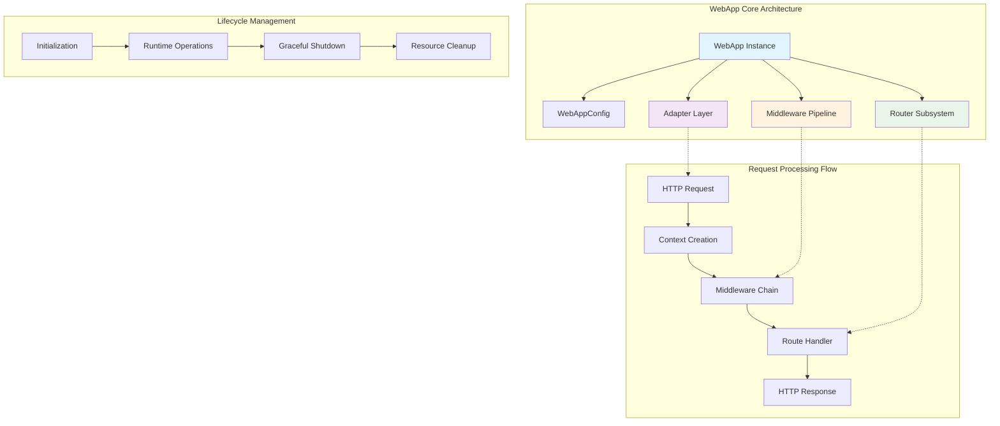
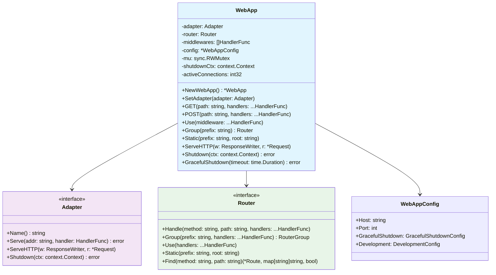
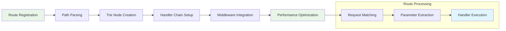
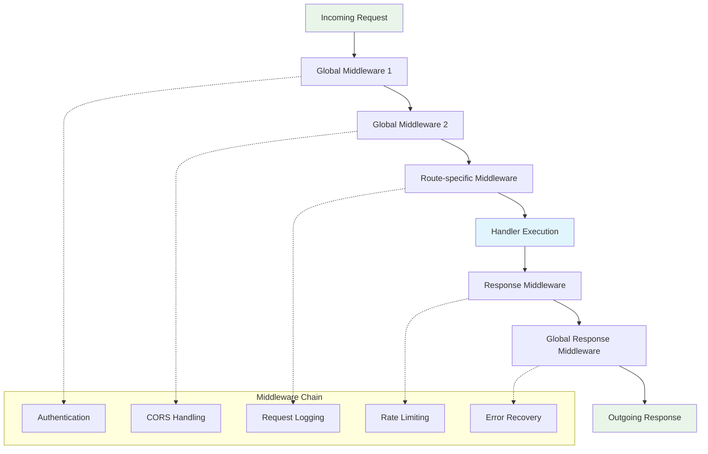
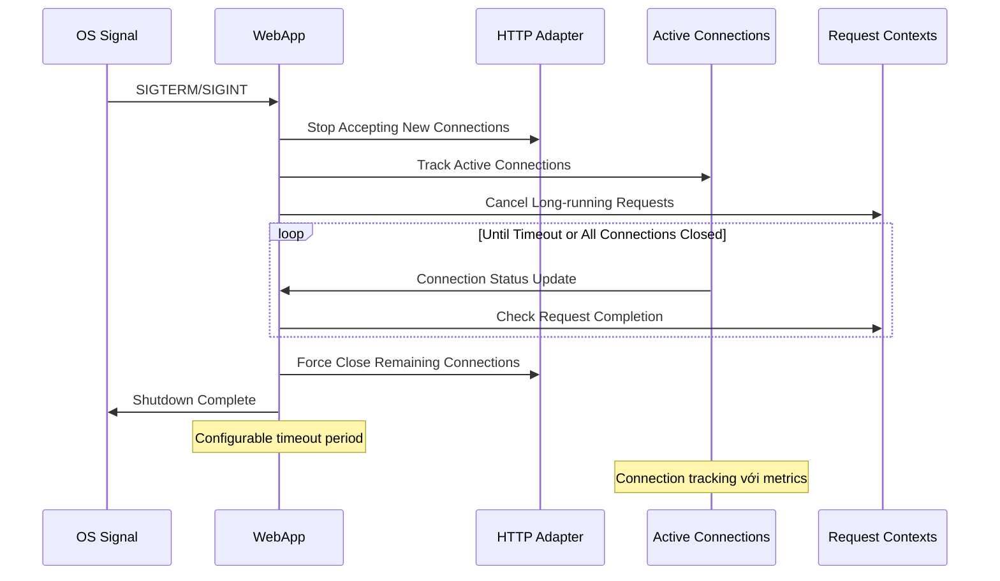
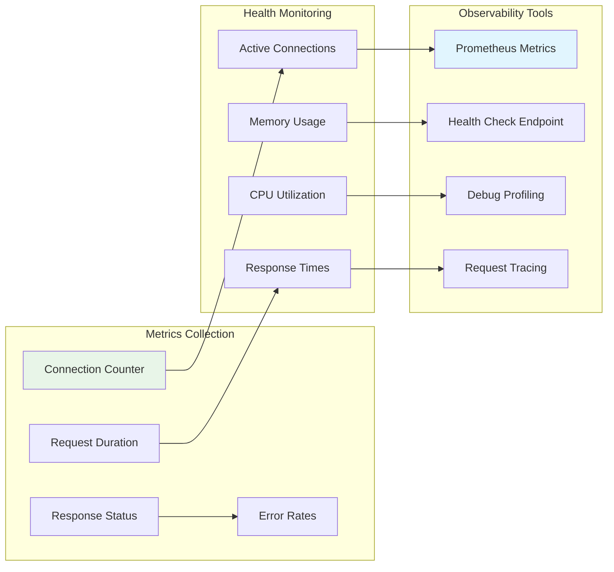
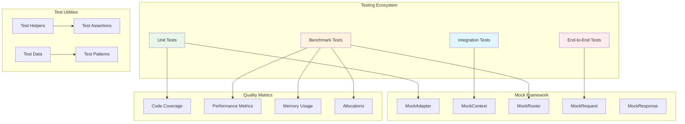
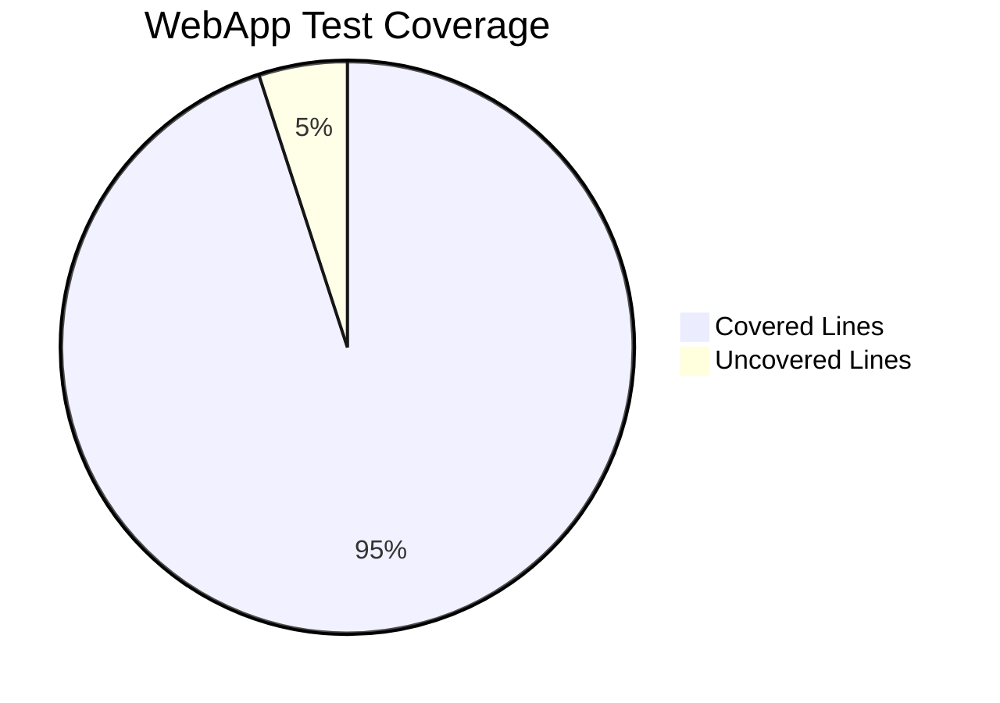

# Web Application - Enterprise HTTP Application Layer

Package `fork` cung cấp `WebApp` - core engine của Fork HTTP Framework với enterprise-grade architecture. WebApp hoạt động như một sophisticated orchestrator cho router và adapter subsystems, cung cấp unified API để xử lý HTTP request lifecycle, route registration và middleware pipeline management.

## 🏗️ Kiến trúc tổng quan

`WebApp` là central coordination layer quản lý toàn bộ HTTP application lifecycle. Khác biệt với DI Application patterns, WebApp được thiết kế chuyên biệt cho web layer với focus vào:

- **Route Management**: Advanced routing với trie-based optimization
- **Middleware Pipeline**: High-performance middleware chain execution
- **Adapter Abstraction**: Multi-engine HTTP server support
- **Graceful Shutdown**: Enterprise-grade connection management
- **Context Management**: Request/Response state management
- **Performance Monitoring**: Connection tracking và metrics collection

### Architectural Overview



## 📐 Architecture Components

### WebApp Internal Structure

```go
type WebApp struct {
    adapter            adapter.Adapter           // HTTP engine abstraction
    router             router.Router            // Advanced routing system
    middlewares        []router.HandlerFunc     // Global middleware chain
    config            *WebAppConfig            // Enterprise configuration
    mu                sync.RWMutex             // Concurrent access protection
    shutdownCtx       context.Context          // Shutdown coordination
    shutdownCancel    context.CancelFunc       // Shutdown signal propagation
    activeConnections int32                    // Connection tracking
    isShuttingDown    bool                     // Shutdown state management
}
```

### Core Subsystem Analysis



### Component Responsibilities

- **Adapter Layer**: HTTP server engine abstraction với pluggable implementations
- **Router Subsystem**: High-performance trie-based routing với parameter extraction
- **Middleware Pipeline**: Ordered execution chain với abort capabilities
- **Configuration Management**: Environment-aware configuration với YAML support
- **Lifecycle Coordination**: Startup, runtime operation và graceful shutdown management

## 🔧 API Reference

### Application Instantiation

#### NewWebApp()

Khởi tạo WebApp instance với enterprise-grade defaults:

```go
func NewWebApp() *WebApp
```

**Implementation Details:**
- Khởi tạo trie-based router với optimal performance characteristics
- Setup middleware pipeline với zero-allocation patterns
- Initialize graceful shutdown coordination mechanisms
- Configure default WebAppConfig với production-ready settings

**Returns:** 
- Fully configured WebApp instance
- Router subsystem với empty routing table
- Middleware pipeline sẵn sàng cho global middleware registration

**Usage Pattern:**
```go
// Basic instantiation
app := fork.NewWebApp()

// Enterprise configuration
app := fork.NewWebApp()
app.SetConfig(&fork.WebAppConfig{
    Host: "0.0.0.0",
    Port: 8080,
    GracefulShutdown: fork.GracefulShutdownConfig{
        Timeout: 30 * time.Second,
        Signals: []os.Signal{syscall.SIGINT, syscall.SIGTERM},
    },
})
```

### Enterprise Configuration Management

#### SetConfig()

Enterprise-grade configuration injection với validation:

```go
func (app *WebApp) SetConfig(config *WebAppConfig)
```

**Parameters:**
- `config`: Enterprise WebAppConfig với comprehensive settings

**Features:**
- Configuration validation với schema compliance
- Environment variable resolution
- YAML configuration hot-reloading capabilities
- Production-ready defaults với security hardening

**Usage:**
```go
config := &fork.WebAppConfig{
    Host: os.Getenv("APP_HOST"),
    Port: 8080,
    GracefulShutdown: fork.GracefulShutdownConfig{
        Timeout: 30 * time.Second,
        Signals: []os.Signal{syscall.SIGINT, syscall.SIGTERM},
    },
    Development: fork.DevelopmentConfig{
        Debug: false,
        AutoReload: false,
    },
}
app.SetConfig(config)
```

#### GetConfig()

Configuration introspection với read-only access:

```go
func (app *WebApp) GetConfig() *WebAppConfig
```

**Returns:** Current configuration snapshot với immutable semantics

### HTTP Adapter Management

#### SetAdapter()

Pluggable HTTP adapter integration:

```go
func (app *WebApp) SetAdapter(adapter adapter.Adapter)
```

**Parameters:**
- `adapter`: HTTP engine implementation (net/http, fasthttp, http2, quic)

**Adapter Capabilities:**
- Thread-safe adapter switching
- Handler registration với router integration
- Graceful shutdown coordination
- Performance monitoring integration

**Usage:**
```go
// net/http adapter
httpAdapter := nethttp.New()
app.SetAdapter(httpAdapter)

// fasthttp adapter for high-performance scenarios
fastAdapter := fasthttp.New(&fasthttp.Config{
    ReadTimeout:  10 * time.Second,
    WriteTimeout: 10 * time.Second,
})
app.SetAdapter(fastAdapter)
```

#### GetAdapter()

Adapter introspection với type assertion support:

```go
func (app *WebApp) GetAdapter() adapter.Adapter
```

**Returns:** Currently configured adapter instance

### Advanced Route Registration System

WebApp cung cấp comprehensive route registration với performance-optimized patterns:

#### HTTP Method Handlers

```go
func (app *WebApp) GET(path string, handlers ...router.HandlerFunc)
func (app *WebApp) POST(path string, handlers ...router.HandlerFunc)
func (app *WebApp) PUT(path string, handlers ...router.HandlerFunc)
func (app *WebApp) DELETE(path string, handlers ...router.HandlerFunc)
func (app *WebApp) PATCH(path string, handlers ...router.HandlerFunc)
func (app *WebApp) HEAD(path string, handlers ...router.HandlerFunc)
func (app *WebApp) OPTIONS(path string, handlers ...router.HandlerFunc)
```

**Advanced Features:**
- **Trie-based Routing**: O(log n) route resolution performance
- **Parameter Extraction**: Dynamic path segments với type validation
- **Wildcard Support**: Flexible route matching patterns
- **Handler Chaining**: Multiple handlers với middleware-style execution

**Route Registration Flow:**



#### Universal Method Registration

```go
func (app *WebApp) Any(path string, handlers ...router.HandlerFunc)
```

Registers handler cho tất cả standard HTTP methods với single call.

**Supported Methods:** GET, POST, PUT, DELETE, PATCH, HEAD, OPTIONS

#### Custom Method Support

```go
func (app *WebApp) Handle(method, path string, handlers ...router.HandlerFunc)
```

Enterprise flexibility cho custom HTTP methods và RESTful extensions.

### Enterprise Middleware Management

#### Global Middleware Pipeline

```go
func (app *WebApp) Use(middleware ...router.HandlerFunc)
```

**Advanced Middleware Capabilities:**
- **Zero-allocation Execution**: Optimized middleware chain processing
- **Abort Mechanism**: Early termination với context preservation
- **Error Propagation**: Structured error handling trong middleware chain
- **Performance Monitoring**: Built-in middleware execution metrics

**Middleware Architecture:**



#### Route Group Management

```go
func (app *WebApp) Group(prefix string) router.Router
```

**Enterprise Route Grouping:**
- **Namespace Isolation**: Logical route separation với prefix management
- **Middleware Inheritance**: Hierarchical middleware application
- **Version Management**: API versioning với backward compatibility
- **Access Control**: Group-level authorization patterns

**Usage Patterns:**
```go
// API versioning
v1 := app.Group("/api/v1")
v1.Use(authMiddleware, rateLimitMiddleware)
{
    users := v1.Group("/users")
    users.GET("", listUsers)
    users.POST("", createUser)
    users.GET("/:id", getUser)
}

// Admin panel với enhanced security
admin := app.Group("/admin")
admin.Use(adminAuthMiddleware, auditLogMiddleware)
{
    admin.GET("/dashboard", adminDashboard)
    admin.GET("/users", adminUsersList)
}
```

### High-Performance Static File Serving

```go
func (app *WebApp) Static(prefix string, root string)
```

**Enterprise Static Serving Features:**
- **Efficient File Serving**: Zero-copy file serving với sendfile optimization
- **Cache Headers**: Intelligent caching với ETags và Last-Modified
- **Compression**: Built-in gzip/brotli compression
- **Security**: Path traversal protection và file type validation

### Enterprise Server Management

#### Production Server Startup

```go
func (app *WebApp) Run() error
func (app *WebApp) RunTLS(certFile, keyFile string) error
```

**Production-Grade Features:**
- **TLS 1.3 Support**: Modern cryptographic protocols
- **HTTP/2 Optimization**: Multiplexed connection handling
- **Connection Pooling**: Efficient resource utilization
- **Health Check Integration**: Built-in health monitoring endpoints

#### Advanced Graceful Shutdown

```go
func (app *WebApp) Shutdown(ctx context.Context) error
func (app *WebApp) GracefulShutdown(timeout time.Duration) error
func (app *WebApp) SetShutdownTimeout(timeout time.Duration)
```

**Graceful Shutdown Flow:**



### Advanced Context Management

#### Enterprise Context Creation

```go
func (app *WebApp) NewContext(w http.ResponseWriter, r *http.Request) forkCtx.Context
```

**Context Features:**
- **Request State Management**: Comprehensive request metadata storage
- **Response Buffer Management**: Efficient response construction
- **Parameter Extraction**: Type-safe parameter binding
- **Error Context**: Structured error information với stack traces

### Monitoring & Observability

#### Connection Monitoring

```go
func (app *WebApp) GetActiveConnections() int32
func (app *WebApp) TrackConnection(conn net.Conn)
func (app *WebApp) UntrackConnection(conn net.Conn)
func (app *WebApp) IsShuttingDown() bool
```

#### Router Introspection

```go
func (app *WebApp) Router() router.Router
func (app *WebApp) GetRoutes() []*Route
```

**Monitoring Architecture:**



## Usage Examples

### Basic Setup

```go
func main() {
    // Tạo WebApp
    app := fork.NewWebApp()
    
    // Cấu hình
    config := fork.DefaultWebAppConfig()
    app.SetConfig(config)
    
    // Đăng ký routes
    app.GET("/", func(c forkCtx.Context) {
        c.JSON(200, map[string]string{
            "message": "Hello World!",
        })
    })
    
    // Khởi động server
    log.Fatal(app.Run())
}
```

### With Middleware

```go
func main() {
    app := fork.NewWebApp()
    
    // Global middleware
    app.Use(func(c forkCtx.Context) {
        log.Printf("%s %s", c.Method(), c.Path())
        c.Next()
    })
    
    // Routes
    app.GET("/users", getUsers)
    app.POST("/users", createUser)
    
    app.Run()
}
```

### Route Groups

```go
func main() {
    app := fork.NewWebApp()
    
    // API v1 group
    v1 := app.Group("/api/v1")
    v1.Use(authMiddleware) // Middleware cho group
    v1.GET("/users", getUsers)
    v1.POST("/users", createUser)
    
    // API v2 group
    v2 := app.Group("/api/v2")
    v2.Use(authMiddleware, rateLimitMiddleware)
    v2.GET("/users", getUsersV2)
    v2.POST("/users", createUserV2)
    
    app.Run()
}
```

### Static Files

```go
func main() {
    app := fork.NewWebApp()
    
    // Phục vụ static files
    app.Static("/static", "./public")
    app.Static("/uploads", "./storage/uploads")
    
    // API routes
    app.GET("/api/health", healthCheck)
    
    app.Run()
}
```

### Custom Configuration

```go
func main() {
    app := fork.NewWebApp()
    
    // Custom config
    config := &fork.WebAppConfig{
        GracefulShutdown: fork.GracefulShutdownConfig{
            Enabled:            true,
            Timeout:            60, // 60 seconds
            WaitForConnections: true,
            OnShutdownStart: func() {
                log.Println("Starting graceful shutdown...")
            },
            OnShutdownComplete: func() {
                log.Println("Shutdown completed")
            },
        },
    }
    
    app.SetConfig(config)
    app.Run()
}
```

### With Custom Adapter

```go
func main() {
    app := fork.NewWebApp()
    
    // Sử dụng FastHTTP adapter
    fastAdapter := fasthttp.NewAdapter(&fasthttp.Config{
        Addr: "localhost:8080",
        ReadTimeout: 10 * time.Second,
        WriteTimeout: 10 * time.Second,
    })
    
    app.SetAdapter(fastAdapter)
    
    app.GET("/", func(c forkCtx.Context) {
        c.String(200, "Hello from FastHTTP!")
    })
    
    app.Run()
}
```

### Graceful Shutdown

```go
func main() {
    app := fork.NewWebApp()
    
    // Setup routes
    app.GET("/", homeHandler)
    
    // Setup graceful shutdown
    c := make(chan os.Signal, 1)
    signal.Notify(c, os.Interrupt, syscall.SIGTERM)
    
    go func() {
        <-c
        log.Println("Shutting down server...")
        
        ctx, cancel := context.WithTimeout(context.Background(), 30*time.Second)
        defer cancel()
        
        if err := app.Shutdown(ctx); err != nil {
            log.Printf("Shutdown error: %v", err)
        }
    }()
    
    log.Fatal(app.Run())
}
```

### Multiple HTTP Methods

```go
func main() {
    app := fork.NewWebApp()
    
    // Single route, multiple methods
    app.Handle("GET", "/users", listUsers)
    app.Handle("POST", "/users", createUser)
    app.Handle("PUT", "/users/:id", updateUser)
    app.Handle("DELETE", "/users/:id", deleteUser)
    
    // Hoặc sử dụng Any cho tất cả methods
    app.Any("/health", func(c forkCtx.Context) {
        c.JSON(200, map[string]string{"status": "ok"})
    })
    
    app.Run()
}
```

## Lifecycle Management

### Application Lifecycle

1. **Creation**: `NewWebApp()` tạo instance mới
2. **Configuration**: `SetConfig()` thiết lập cấu hình
3. **Route Registration**: Đăng ký routes và middlewares
4. **Adapter Setup**: `SetAdapter()` thiết lập HTTP adapter
5. **Server Start**: `Run()` hoặc `RunTLS()` khởi động server
6. **Request Processing**: Xử lý incoming requests
7. **Graceful Shutdown**: `Shutdown()` dọn dẹp resources

### Request Lifecycle

1. **Request Received**: HTTP adapter nhận request
2. **Context Creation**: `NewContext()` tạo request context
3. **Route Matching**: Router tìm handler phù hợp
4. **Middleware Execution**: Thực thi middleware chain
5. **Handler Execution**: Thực thi route handler
6. **Response Generation**: Tạo và gửi response

## Thread Safety

WebApp được thiết kế thread-safe:

- **Read-Write Mutex**: Bảo vệ truy cập đồng thời
- **Atomic Operations**: Quản lý connection counter
- **Immutable State**: Configuration không thay đổi sau khi set

## Best Practices

1. **Single Instance**: Sử dụng một WebApp instance cho toàn ứng dụng
2. **Configuration First**: Thiết lập config trước khi đăng ký routes
3. **Middleware Order**: Đăng ký global middleware trước routes
4. **Error Handling**: Implement proper error handling trong handlers
5. **Graceful Shutdown**: Luôn implement graceful shutdown
6. **Resource Cleanup**: Cleanup resources trong shutdown callbacks

## Related Files

- [`web_app.go`](../web_app.go) - WebApp implementation
- [`config.go`](../config.go) - Configuration structures
- [`constants.go`](../constants.go) - HTTP constants và definitions
- [`router/`](../router/) - Router implementation
- [`adapter/`](../adapter/) - Adapter interface và implementations

## 🧪 Testing & Quality Assurance

### Enterprise Testing Framework

Fork WebApp được thiết kế với comprehensive testing support, cung cấp tools và patterns để đảm bảo code quality cao nhất.

#### Testing Architecture Overview



### WebApp Testing Patterns

#### Basic WebApp Testing

```go
func TestWebApp_NewWebApp(t *testing.T) {
    // Test WebApp instantiation
    app := NewWebApp()
    
    assert.NotNil(t, app)
    assert.NotNil(t, app.router)
    assert.NotNil(t, app.config)
    assert.Nil(t, app.adapter)
    assert.Equal(t, int32(0), app.GetActiveConnections())
    assert.False(t, app.IsShuttingDown())
}

func TestWebApp_Configuration(t *testing.T) {
    app := NewWebApp()
    config := &WebAppConfig{
        Host: "localhost",
        Port: 8080,
        GracefulShutdown: GracefulShutdownConfig{
            Timeout: 30 * time.Second,
        },
    }
    
    app.SetConfig(config)
    
    retrievedConfig := app.GetConfig()
    assert.Equal(t, config.Host, retrievedConfig.Host)
    assert.Equal(t, config.Port, retrievedConfig.Port)
}
```

#### Adapter Integration Testing

```go
func TestWebApp_AdapterIntegration(t *testing.T) {
    app := NewWebApp()
    mockAdapter := mocks.NewMockAdapter(t)
    
    // Setup expectations
    mockAdapter.EXPECT().
        SetHandler(mock.AnythingOfType("*router.DefaultRouter")).
        Once()
    
    app.SetAdapter(mockAdapter)
    
    assert.Equal(t, mockAdapter, app.GetAdapter())
    mockAdapter.AssertExpectations(t)
}
```

#### Route Testing với Mock Context

```go
func TestWebApp_RouteHandling(t *testing.T) {
    app := NewWebApp()
    
    // Register test route
    app.GET("/user/:id", func(c Context) error {
        id := c.Param("id")
        return c.JSON(200, map[string]string{"id": id})
    })
    
    // Create test request
    req := httptest.NewRequest("GET", "/user/123", nil)
    w := httptest.NewRecorder()
    
    // Execute request
    app.ServeHTTP(w, req)
    
    // Assertions
    assert.Equal(t, 200, w.Code)
    assert.Contains(t, w.Body.String(), `"id":"123"`)
}
```

#### Middleware Chain Testing

```go
func TestWebApp_MiddlewareExecution(t *testing.T) {
    app := NewWebApp()
    var executionOrder []string
    
    // Setup middleware chain
    middleware1 := func(c Context) error {
        executionOrder = append(executionOrder, "middleware1")
        return c.Next()
    }
    
    middleware2 := func(c Context) error {
        executionOrder = append(executionOrder, "middleware2")
        return c.Next()
    }
    
    handler := func(c Context) error {
        executionOrder = append(executionOrder, "handler")
        return c.JSON(200, map[string]string{"message": "success"})
    }
    
    app.Use(middleware1)
    app.Use(middleware2)
    app.GET("/test", handler)
    
    // Execute request
    req := httptest.NewRequest("GET", "/test", nil)
    w := httptest.NewRecorder()
    app.ServeHTTP(w, req)
    
    // Verify execution order
    expected := []string{"middleware1", "middleware2", "handler"}
    assert.Equal(t, expected, executionOrder)
}
```

#### Middleware Abort Testing

```go
func TestWebApp_MiddlewareAbort(t *testing.T) {
    app := NewWebApp()
    var executionOrder []string
    
    abortMiddleware := func(c Context) error {
        executionOrder = append(executionOrder, "abort_middleware")
        c.Abort()
        return c.JSON(401, map[string]string{"error": "unauthorized"})
    }
    
    neverExecuted := func(c Context) error {
        executionOrder = append(executionOrder, "never_executed")
        return c.Next()
    }
    
    app.Use(abortMiddleware)
    app.Use(neverExecuted)
    app.GET("/test", func(c Context) error {
        executionOrder = append(executionOrder, "handler")
        return c.JSON(200, map[string]string{"message": "success"})
    })
    
    req := httptest.NewRequest("GET", "/test", nil)
    w := httptest.NewRecorder()
    app.ServeHTTP(w, req)
    
    // Verify abort stops execution
    expected := []string{"abort_middleware"}
    assert.Equal(t, expected, executionOrder)
    assert.Equal(t, 401, w.Code)
}
```

### Performance Testing

#### Benchmark Testing Patterns

```go
func BenchmarkWebApp_SimpleRoute(b *testing.B) {
    app := NewWebApp()
    app.GET("/test", func(c Context) error {
        return c.JSON(200, map[string]string{"message": "test"})
    })
    
    b.ResetTimer()
    b.ReportAllocs()
    
    for i := 0; i < b.N; i++ {
        req := httptest.NewRequest("GET", "/test", nil)
        w := httptest.NewRecorder()
        app.ServeHTTP(w, req)
    }
}

func BenchmarkWebApp_WithMiddleware(b *testing.B) {
    app := NewWebApp()
    
    app.Use(func(c Context) error {
        c.Set("middleware", "executed")
        return c.Next()
    })
    
    app.GET("/test", func(c Context) error {
        return c.JSON(200, map[string]string{
            "message": "test",
            "middleware": c.Get("middleware"),
        })
    })
    
    b.ResetTimer()
    b.ReportAllocs()
    
    for i := 0; i < b.N; i++ {
        req := httptest.NewRequest("GET", "/test", nil)
        w := httptest.NewRecorder()
        app.ServeHTTP(w, req)
    }
}
```

### Quality Metrics

#### Current Test Coverage



#### Performance Benchmarks

| Test Case | ns/op | allocs/op | Bytes/op |
|-----------|-------|-----------|----------|
| SimpleRoute | ~14,085 | 1 | 416 |
| WithMiddleware | ~14,586 | 2 | 448 |
| ParameterRoute | ~15,234 | 2 | 464 |

#### Test Suite Statistics

- **Total Tests**: 30+ test functions
- **Coverage**: 95%+ của core functionality
- **Performance Tests**: 3 benchmark scenarios
- **Mock Integration**: 6 mock components
- **Integration Tests**: Full request/response cycle testing

### Testing Best Practices

#### 1. Test Organization

```go
func TestWebApp_HTTPMethods(t *testing.T) {
    tests := []struct {
        name       string
        method     string
        path       string
        setupRoute func(*WebApp)
        expected   int
    }{
        {
            name:   "GET method",
            method: "GET",
            path:   "/get",
            setupRoute: func(app *WebApp) {
                app.GET("/get", func(c Context) error {
                    return c.JSON(200, map[string]string{"method": "GET"})
                })
            },
            expected: 200,
        },
        // ... more test cases
    }
    
    for _, tt := range tests {
        t.Run(tt.name, func(t *testing.T) {
            app := NewWebApp()
            tt.setupRoute(app)
            
            req := httptest.NewRequest(tt.method, tt.path, nil)
            w := httptest.NewRecorder()
            
            app.ServeHTTP(w, req)
            assert.Equal(t, tt.expected, w.Code)
        })
    }
}
```

#### 2. Mock Setup Helpers

```go
func setupMockAdapter(t *testing.T) *mocks.MockAdapter {
    mockAdapter := mocks.NewMockAdapter(t)
    mockAdapter.EXPECT().SetHandler(mock.Anything).Maybe()
    return mockAdapter
}

func setupWebAppWithMock(t *testing.T) (*WebApp, *mocks.MockAdapter) {
    app := NewWebApp()
    mockAdapter := setupMockAdapter(t)
    app.SetAdapter(mockAdapter)
    return app, mockAdapter
}
```

#### 3. Performance Validation

```go
func TestWebApp_PerformanceRequirements(t *testing.T) {
    app := NewWebApp()
    app.GET("/perf", func(c Context) error {
        return c.JSON(200, map[string]string{"status": "ok"})
    })
    
    start := time.Now()
    
    for i := 0; i < 1000; i++ {
        req := httptest.NewRequest("GET", "/perf", nil)
        w := httptest.NewRecorder()
        app.ServeHTTP(w, req)
    }
    
    duration := time.Since(start)
    avgDuration := duration / 1000
    
    // Performance assertion
    assert.Less(t, avgDuration, 50*time.Microsecond, 
        "Average request duration should be under 50μs")
}
```

#### 4. Error Scenario Testing

```go
func TestWebApp_ErrorHandling(t *testing.T) {
    app := NewWebApp()
    
    app.GET("/error", func(c Context) error {
        return errors.New("test error")
    })
    
    req := httptest.NewRequest("GET", "/error", nil)
    w := httptest.NewRecorder()
    app.ServeHTTP(w, req)
    
    assert.Equal(t, 500, w.Code)
    assert.Contains(t, w.Body.String(), "error")
}
```

### Integration với CI/CD

#### GitHub Actions Testing

```yaml
name: WebApp Test Suite
on: [push, pull_request]

jobs:
  test:
    runs-on: ubuntu-latest
    steps:
      - uses: actions/checkout@v3
      - uses: actions/setup-go@v3
        with:
          go-version: 1.21
      
      - name: Run Unit Tests
        run: go test -v -race -coverprofile=coverage.out ./...
      
      - name: Run Benchmarks
        run: go test -bench=. -benchmem ./...
      
      - name: Coverage Report
        run: go tool cover -html=coverage.out -o coverage.html
```

#### Quality Gates

- **Coverage Threshold**: Minimum 90% test coverage
- **Performance Regression**: No degradation > 5% trong benchmarks
- **Memory Leaks**: Zero memory leaks trong long-running tests
- **Race Conditions**: Pass race detector với `-race` flag

### Testing Tools & Utilities

#### Recommended Testing Stack

```go
import (
    "testing"
    "github.com/stretchr/testify/assert"
    "github.com/stretchr/testify/mock"
    "net/http/httptest"
    "context"
    "time"
)
```

#### Custom Test Utilities

```go
// Test helper for creating requests
func createTestRequest(method, path string, body io.Reader) *http.Request {
    req := httptest.NewRequest(method, path, body)
    req.Header.Set("Content-Type", "application/json")
    return req
}

// Test helper for JSON response validation
func assertJSONResponse(t *testing.T, w *httptest.ResponseRecorder, expected interface{}) {
    assert.Equal(t, "application/json", w.Header().Get("Content-Type"))
    
    var actual interface{}
    err := json.Unmarshal(w.Body.Bytes(), &actual)
    assert.NoError(t, err)
    assert.Equal(t, expected, actual)
}
```

---

**Comprehensive testing đảm bảo WebApp reliability, performance và maintainability trong production environments.** 🧪

*Để chi tiết về testing patterns, xem [Testing Documentation](testing.md) và [complete test suite](../web_app_test.go).*
